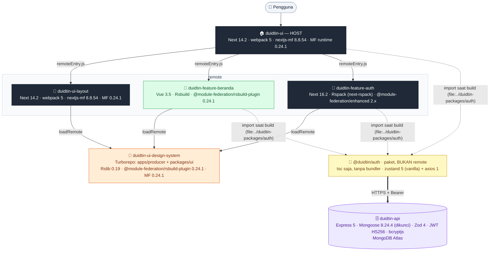

# x-duidtin

[English](README.md) · **Bahasa Indonesia**

Super-app microfrontend berbasis Module Federation.

## Enam repo, enam project Vercel

Module Federation menyatukan aplikasi **saat runtime lewat kontrak**, bukan saat build. Kontraknya cuma tiga hal: nama container, daftar `exposes`, dan share scope. Selama ketiganya cocok, tiap repo bebas memilih framework dan bundler-nya sendiri — tidak ada satu pun `npm install` di antara mereka.

### 1. `duidtin-ui` — host

- **Port** — 3000
- **Framework** — Next.js 14.2.35, Pages Router
- **Bundler** — webpack 5.105.0 (`NEXT_PRIVATE_LOCAL_WEBPACK=true`)
- **Plugin MF** — `@module-federation/nextjs-mf` 8.8.54
- **MF runtime** — `@module-federation/runtime` 0.24.1 + `retry-plugin` 0.24.1
- **React** — 18.3.1
- **Tailwind** — v4.1.18, prefix `app`
- **Path** — tidak ada `basePath`; host memegang root domain
- **Peran** — shell: routing, registry remote, consumer semua remote
- **Catatan** — `remotes: {}` dan `exposes: {}` sengaja dikosongkan; daftar remote di-resolve runtime, bukan build time

### 2. `duidtin-ui-design-system` — pustaka komponen

- **Port** — 3001
- **Framework** — tidak pakai Next sama sekali
- **Bundler** — Rslib 0.19.5 + Rsbuild (`@rsbuild/plugin-react` 1.4.4)
- **Struktur** — monorepo Turborepo 2.9.6, package manager bun 1.3.8 (`apps/producer` + `packages/ui`)
- **Plugin MF** — `@module-federation/rsbuild-plugin` 0.24.1
- **React** — 18.3.1
- **Tailwind** — v4.1.18, prefix `ui`
- **Path** — `/design-system/static/`
- **Peran** — 18 komponen UI + style, di-expose satu per satu. 11 di antaranya juga tersedia sebagai Web Component `<dtn-*>` untuk konsumen non-React (Vue/Svelte/Angular), memakai komponen React dan CSS yang sama
- **Catatan** — `dev: { hmr: false, liveReload: false }` wajib; tanpa itu dev client-nya memanggil `location.reload()` di halaman **konsumen**

### 3. `duidtin-ui-layout` — layout bersama

- **Port** — 3002
- **Framework** — Next.js 14.2.35, Pages Router
- **Bundler** — webpack 5.105.0 (`NEXT_PRIVATE_LOCAL_WEBPACK=true`)
- **Plugin MF** — `@module-federation/nextjs-mf` 8.8.54
- **MF runtime** — 0.24.1
- **React** — 18.3.1
- **Tailwind** — v4.1.18, prefix `lyt`
- **Path** — `basePath: "/layout"`
- **Peran** — header + footer, membungkus konten tiap halaman
- **Catatan** — peran ganda: remote buat host, sekaligus konsumen design-system. `assetPrefix` absolut wajib saat dev, kalau tidak chunk-nya diminta ke origin host dan 404

### 4. `duidtin-feature-beranda` — beranda

- **Port** — 3003
- **Framework** — **Vue 3.5** — satu-satunya repo yang bukan React
- **Bundler** — **Rsbuild 1.x** (tanpa Next: tidak butuh routing maupun SSR)
- **Plugin MF** — `@module-federation/rsbuild-plugin` 0.24.1
- **React** — **tidak dipasang**; komponen design-system dipakai lewat pembungkus Web Component `<dtn-*>`
- **Styling** — Tailwind v4, prefix `fber` (pola BEM + `@apply`, sama dengan repo lain)
- **Path** — `/beranda` (`server.base` + `assetPrefix`)
- **Peran** — beranda: ringkasan saldo, antrean persetujuan, pintasan. Feature remote pertama, jadi repo ini yang bikin FASE 2 di host benar-benar jalan
- **Catatan** — yang di-expose **bukan komponen** tapi fungsi `mount(el)`, karena React tidak bisa merender komponen Vue. Host memanggilnya lewat `components/federation/remote-mount.tsx`. Sesi tetap satu lewat `@duidtin/auth/vue` — store yang sama dengan host

### 5. `duidtin-feature-auth` — login

- **Port** — 3004
- **Framework** — Next.js 16.2.9
- **Bundler** — **Rspack** (`next-rspack` 16.2.9)
- **Plugin MF** — `@module-federation/enhanced` 2.x
- **React** — 18.3.1 (wajib sama dengan host)
- **Styling** — Tailwind v4, prefix `fath`
- **Path** — `basePath: "/auth"`
- **Peran** — halaman login (`./login`) dan modal sesi berakhir (`./sesi-berakhir`): form email/password, `login()` dari `@duidtin/auth`, menampilkan `AuthError`
- **Catatan** — satu-satunya feature remote yang berfungsi penuh saat dibuka sendiri (`:3004`), karena paket auth membuat store cadangan. `pages/index.tsx` wajib memakai `dynamic()` sebagai async boundary — lihat [README repo](duidtin-feature-auth/README.id.md)

### 6. `duidtin-api` — backend

- **Port** — 4000
- **Runtime** — Bun saat dev, Node.js (Vercel Function) di produksi
- **Stack** — Express 5 · Mongoose 8.24.4 (dikunci) · Zod 4 · JWT HS256 · bcryptjs
- **Database** — MongoDB Atlas
- **Path** — **tidak ada**: diakses langsung ke domainnya sendiri, bukan lewat rewrite host
- **Peran** — API auth (`login`, `refresh`, `logout`, `logout-semua`, `me`) + data beranda (`GET /beranda/rekening`, `/persetujuan`, `/aktivitas`, read-only, semuanya butuh sesi)
- **Catatan** — satu-satunya bagian yang **bukan** Module Federation. FE memanggilnya lewat `NEXT_PUBLIC_API_URL`, dan origin FE harus terdaftar di `CORS_ORIGINS` milik API. Rinciannya di [README.be.id.md](README.be.id.md) dan [duidtin-api/README.id.md](duidtin-api/README.id.md)

> Penamaan: `ui-*` untuk infrastruktur (host, design-system, layout), `feature-*` untuk fitur bisnis.

Tiga perbedaan paling mencolok di atas bukan kebetulan, tapi memang dibiarkan berbeda:

- **Design-system tidak pakai Next sama sekali.** Dia cuma pustaka komponen — tidak butuh routing, tidak butuh SSR. Rslib menghasilkan bundel lebih ramping untuk keperluan itu.
- **Layout pakai Next** karena nanti perlu menjembatani context aplikasi (auth, menu per peran), bukan sekadar merender komponen.
- **Beranda pakai Vue, bukan React.** Ini eksperimen yang paling jauh: membuktikan remote boleh beda framework, bukan cuma beda bundler. Komponennya tetap komponen design-system yang sama — lewat pembungkus `<dtn-*>` — dan sesinya tetap satu store. Rsbuild dipilih (bukan Vite) supaya versi MF-nya sama persis dengan design-system, 0.24.1.

### Paket bersama: `@duidtin/auth`

**Inti + React + Vue selesai (25 tes lolos). Dipakai host (store, guard, modal sesi berakhir), `duidtin-feature-auth` (login + login ulang), dan `duidtin-feature-beranda` (sapaan dari sesi, lewat subpath `/vue`); layout belum.** Paket di [`duidtin-packages/auth`](duidtin-packages/auth/README.id.md), bukan remote, jadi tidak punya project Vercel.

```
boot host — _app.tsx, sebelum federationInit()
  └─▶ installAuthStore()  buat store (zustand/vanilla) → hydrate localStorage["duidtin:sesi"]
                          → window.__DUIDTIN_AUTH__

remote (layout, beranda, auth)
  └─▶ getAuthStore()      pinjam store host
                          global tidak ada (repo dibuka sendiri saat dev) → buat store lokal

login — remote auth
  └─▶ login(email, password) → POST /auth/login → isi store → store tulis localStorage
                          → semua komponen yang berlangganan ikut berubah

ambil data — remote mana pun
  └─▶ http.get("/beranda/rekening")        instance axios, interceptor bawaan paket
        ├─ sisa access token < 30 detik  → refresh dulu
        ├─ 401 TOKEN_KEDALUWARSA         → refresh → ulangi SEKALI
        ├─ gagal lain                    → dilempar sebagai AuthError
        └─ refresh ditolak               → status "kedaluwarsa" → request DITAHAN

sesi berakhir (1 hari sejak login, atau refresh ditolak)
  └─▶ status "kedaluwarsa", nama + email pengguna tetap diingat
        ├─ host menumpangkan modal login ulang (remote auth, expose ./sesi-berakhir)
        ├─ halaman TIDAK dibuang, tidak ada redirect
        └─ password benar → request tertahan lanjut dengan token baru

tab lain
  └─▶ event "storage" → store menyesuaikan
```

| Ekspor | Fungsi |
|---|---|
| `@duidtin/auth` | `configureAuth({ baseUrl })`, `installAuthStore()`, `getAuthStore()`, `http` (instance axios), `login()`, `logout()`, `logoutAll()`, `refreshProfile()` |
| `@duidtin/auth/react` | `useAuth()` → `{ user, status, isLoggedIn, sesiKedaluwarsa, penggunaTerakhir, login, logout, logoutAll, refreshProfile }` |
| `/vue`, `/svelte`, `/angular` | menyusul; inti tanpa framework, jadi pembungkusnya belasan baris |

- Store sesi **hanya dibuat host**; remote meminjam objeknya (`getState`, `subscribe`, aksi) — tanpa kelas dan tanpa React, jadi aman lintas framework dan bundler.
- Store bisnis tetap milik tiap remote.
- Inti tidak membaca `process.env`; base URL diisi tiap app lewat `configureAuth()`.
- Kontrak sesi lengkap: [README.be.id.md](README.be.id.md).

## Deploy

> **Status: enam project ter-deploy.**

| Project | URL | Catatan |
|---|---|---|
| host | `https://super-apps-duidtin.vercel.app` | menyatukan semua remote lewat rewrites |
| design-system | `https://super-apps-duidtin-ui-system.vercel.app` | Storybook di `/storybook/` |
| layout | `https://super-apps-duidtin-ui-layout.vercel.app/layout` | `remoteEntry.js` di `/layout/_next/static/chunks/` |
| beranda | ter-deploy | `/beranda/*` masih 404 — `REMOTE_BERANDA_URL` di host belum benar |
| auth | `https://super-apps-duidtin-feature-auth.vercel.app` | `/login` di host sudah merender formnya |
| api | `https://super-apps-duidtin-api-eta.vercel.app` | `/health` → `db: "terhubung"`, login 200 |

Yang masih menggantung: `NEXT_PUBLIC_API_URL` belum diisi di project host dan auth, jadi halaman login produksi masih menembak `http://localhost:4000`.

### Topologi: satu domain, dibedakan path

```
https://super-apps-duidtin.vercel.app/                                  → project host
https://super-apps-duidtin.vercel.app/layout/_next/static/…             → project layout
https://super-apps-duidtin.vercel.app/beranda/_next/static/…            → project beranda
https://super-apps-duidtin.vercel.app/design-system/static/…            → project design-system
https://super-apps-duidtin.vercel.app/auth/_next/static/…               → project auth
```

**Backend TIDAK ikut pola ini.** `duidtin-api` diakses langsung ke domainnya sendiri
(`https://super-apps-duidtin-api-eta.vercel.app`), bukan lewat rewrite `/api`. Konsekuensinya
dua: URL-nya diisi lewat env `NEXT_PUBLIC_API_URL` di tiap bundle yang memanggilnya, dan
origin host harus terdaftar di `CORS_ORIGINS` milik API.

Topologi ini **sudah dikunci oleh kode**, bukan pilihan bebas. Di ketiga repo Next, `getBaseFederationUrl()` memulangkan `window.location.origin` saat bukan localhost, jadi di produksi host mencari semua remote di domain yang sama dengan dirinya. Kalau tiap remote dipublish ke domainnya sendiri, host langsung rusak.

Satu origin juga yang membuat sesi sederhana: `localStorage` otomatis dipakai bersama semua remote — itulah yang membuat satu store sesi di `window.__DUIDTIN_AUTH__` cukup untuk seluruh halaman.

### Env var host

| Env var | Isi | Rewrite |
|---|---|---|
| `REMOTE_DESIGN_SYSTEM_URL` | URL `*.vercel.app` design-system | `/design-system/static/:path*` → `…/:path*` |
| `REMOTE_LAYOUT_URL` | URL `*.vercel.app` layout | `/layout/:path*` → `…/layout/:path*` |
| `REMOTE_BERANDA_URL` | URL `*.vercel.app` beranda | `/beranda/:path*` → `…/beranda/:path*` |
| `REMOTE_AUTH_URL` | `duidtin-feature-auth` | `/auth/:path*` → `…/auth/:path*` |
| `NEXT_PUBLIC_API_URL` | URL `duidtin-api` | **tanpa rewrite** — dibaca `configureAuth()` di bundle host. Remote yang memanggil API mengisinya sendiri juga (`duidtin-feature-auth`) |

- **Design-system membuang prefiksnya**, karena bukan Next dan tanpa `basePath`: berkasnya ada di root domain Vercel-nya. Layout dan beranda tetap membawa prefiks.
- **Dev lokal:** env kosong → rewrites tidak aktif → remote diakses langsung lewat port masing-masing.

### Aturan untuk remote berikutnya

**basePath remote tidak boleh bentrok dengan route host.** Rewrites Next dijalankan setelah halaman host dicek, tapi sebelum dynamic route:

```
host punya route /mutasi/[...slug]   +   remote basePath /mutasi
  └─▶ /mutasi/_next/… ditangkap halaman host → remote gagal dimuat, tanpa pesan jelas
```

Bentuk yang benar untuk auth nanti: **route** `/login` dan `/aktivasi` adalah halaman host, **basePath aset** `duidtin-feature-auth` adalah `/auth`.

Distribusi paket `@duidtin/auth` — dua tahap, tidak dipakai bersamaan:

```
TAHAP 1 — path lokal (sekarang)
  duidtin-packages/auth ──file:../duidtin-packages/auth──▶ host, layout, beranda, auth
    bun MENYALIN paket saat install, bukan menautkan
    ubah paket → bun run build di paket → bun install di repo pemakai
    (saat `bun run build` repo pemakai, `prebuild` melakukan keduanya otomatis)

TAHAP 2 — GitHub Packages (nanti)
  duidtin-packages/auth ──tag──▶ publish ──▶ registry ──"@duidtin/auth": "^0.1.0"──▶ tiap repo
    ubah paket → bump versi → publish → naikkan versi di repo pemakai
```

| | Tahap 1 | Tahap 2 |
|---|---|---|
| Butuh | opsi Vercel "sertakan berkas di luar Root Directory", `prebuild` pembangun paket, `ignoreCommand` ikut memeriksa folder paket | scope `@duidtin` di `bunfig.toml`, env `NPM_TOKEN` tiap project Vercel, workflow publish |
| Versi per repo | selalu terbaru | dikunci masing-masing |
| Pemicu pindah | — | ada remote yang menahan versi lama, tim lain ikut memakai, atau repo paket dipisah |

```
LANGKAH PINDAH (sekali)
  1. publishConfig + repository di duidtin-packages/auth/package.json
  2. workflow GitHub Actions: publish saat ada tag (GITHUB_TOKEN)
  3. publish 0.1.0
  4. tiap repo pemakai: file:… → ^0.1.0 + scope @duidtin di bunfig.toml
  5. tiap project Vercel: env NPM_TOKEN (PAT read:packages)
  6. hapus prebuild pembangun paket + ../duidtin-packages/auth dari ignoreCommand
     └─ boleh bertahap per repo; jangan lama-lama, versinya bisa menyimpang diam-diam
```

Setelah tahap 2, iterasi harian tanpa publish:

```bash
cd duidtin-packages/auth && bun link          # sekali
cd ../../duidtin-ui      && bun link @duidtin/auth
# laptop → versi lokal, Vercel → registry; lepas dengan bun unlink
```

### Kalau nanti pindah ke VPS + Docker + Caddy

Rewrites produksi di host dihapus, dan Caddy mengambil peran router — hasilnya persis seperti qcash dengan router OpenShift-nya. Ketiga repo Next sudah `output: "standalone"`, jadi tinggal dibungkus container.

```caddy
duidtin.com {
	@entry path */remoteEntry.js */mf-manifest.json
	header @entry Cache-Control "no-cache"

	handle_path /design-system/static/* {
		root * /srv/design-system
		file_server
	}
	handle /layout/*  { reverse_proxy layout:3002 }
	handle /beranda/* { reverse_proxy beranda:3003 }
	handle            { reverse_proxy host:3000 }
}
```

---

## Feature flag

Belum dipakai. Dicatat di sini karena inilah yang akan dipakai kalau nanti butuh **menyalakan atau mematikan fitur tanpa deploy** — misalnya kill switch saat produksi bermasalah, atau membuka fitur hanya untuk peran tertentu.

Selama belum sampai ke situ, cukup dua cara yang tidak butuh perkakas apa pun:

- **Satu remote utuh** disembunyikan dengan tidak mendaftarkannya di `featureRegistry` host. Ini sudah pernah dipakai: beranda sempat dilepas supaya host bisa di-deploy lebih dulu.
- **Bagian di dalam satu remote** (misal `search` v1 → v2) dipisah di balik satu custom hook, lalu dipilih dengan `process.env.NEXT_PUBLIC_*`. Karena nilainya ditanam saat build, cabang yang mati dibuang minifier dan kodenya tidak ikut terkirim ke pengguna.

Rancangan kalau nanti dibuat di `duidtin-api`:

1. **Penyimpanan:** satu koleksi `konfigurasi` di MongoDB.
2. **Endpoint:** `GET /konfigurasi`, cache pendek (30–60 detik), bentuk respons mengikuti `ApiResponse<T>`.
3. **Pembacaan di client:** diambil sekali saat boot. **Default mati** selama masih dimuat atau saat request gagal — fitur baru harus gagal ke arah aman.
4. **Cara mengubah:** script CLI di `duidtin-api` (mis. `bun run flag pencarianV2 on`). Halaman admin menyusul kalau memang perlu.
5. **Per pengguna atau peran:** titipkan di `/auth/me`, yang sudah dipanggil frontend untuk menyegarkan data tampilan.

Dua hal yang khas MFE dan mudah terlewat:

- **Nilai flag datang asinkron**, sedangkan `featureRegistry` dibaca **sinkron** di FASE 1. Jadi pengecekan flag ditaruh di level halaman atau komponen, bukan di registry host.
- **Umur flag.** Tulis kapan flag harus dihapus. Flag rollout yang lupa dibersihkan menumpuk, dan tiap flag menggandakan jalur kode yang harus diuji.

Flag mengatur tampilan, bukan akses. Fitur yang menyangkut data sensitif tetap harus ditolak backend lewat peran, karena siapa pun bisa memanggil endpoint-nya langsung.

## Peta Arsitektur

Siapa memuat siapa, dan dengan stack apa — keadaan repo saat ini.



**Warna = toolchain**, bukan peran: ⬛ hitam Next.js · 🟧 oranye Rsbuild/Rslib · 🟩 hijau Vue · 🟨 kuning paket biasa · 🟪 ungu backend. Beranda satu-satunya yang hijau — satu-satunya remote yang bukan React. Garis putus-putus = ketergantungan **build time** (`file:`), bukan Module Federation — `@duidtin/auth` di-`import` biasa, tiap repo mem-bundle salinannya sendiri, dan yang mereka bagi cuma store di `window`. Rincian stack tiap repo ada di [Enam repo, enam project Vercel](#enam-repo-enam-project-vercel) di atas.

Tiga hal yang tidak terlihat di gambar tapi menentukan:

| Hal | Isi |
|---|---|
| Host **tidak** memakai design-system | shell-nya tipis dan tidak merender komponen UI sendiri; DS dikonsumsi layout dan tiap feature remote |
| `@duidtin/auth` bukan remote | paket biasa yang di-`import` saat build, jadi tiap bundle punya salinan kodenya. Yang tunggal cuma **objek store**-nya, diparkir di `window.__DUIDTIN_AUTH__` oleh host |
| Tipe komponen mengalir lewat arsip | design-system membangun `@mf-types.zip`; tiap konsumen mengunduhnya (`bun run tipe`) dan memakai tipe aslinya, bukan menyalin props dengan tangan |
| Panah ke API cuma satu | semua request bertoken lewat instance `http` di paket itu — token, refresh, retry, dan tahan-ulang saat sesi berakhir ada di satu tempat |

Keadaan tiap bagian sekarang:

| Bagian | Kode | Produksi |
|---|---|---|
| host, layout, design-system | ✅ | ✅ live |
| remote auth | ✅ login + modal sesi berakhir | ✅ live, `/login` di host sudah merender formnya |
| beranda | ✅ tampilan, **data masih mock** | ⚠️ `REMOTE_BERANDA_URL` belum benar → `/beranda/*` 404 |
| `duidtin-api` | ✅ auth lengkap, endpoint data belum ada | ✅ live, `/health` → `db: "terhubung"` |
| sambungan FE → API | — | ⚠️ `NEXT_PUBLIC_API_URL` belum diisi di host & auth → login produksi masih ke `localhost:4000` |

## Alur Arsitektur

Diagram lima fase. Penjelasan tiap fungsi — parameter, nilai balik, dan contoh datanya — ada di [README `duidtin-ui`](duidtin-ui/README.id.md#alur-arsitektur).

### 1. Build time

```
next.config.mjs (duidtin-ui)
  └─▶ NextFederationPlugin({ ...federationConfig })
        name     : "duidtin_ui"
        filename : "static/chunks/remoteEntry.js"
        remotes  : {}    ← sengaja kosong, di-resolve runtime bukan build time
        exposes  : {}    ← host cuma consumer, nggak pernah jadi remote
        shared   : {}    ← nextjs-mf auto-share react/react-dom/next
```

### 2. Boot

```
pages/_app.tsx  (top-level, client-only, sebelum React render apapun)
  └─▶ federationInit()                                   → Promise<void>
        │
        ├─  guard  window.__FEDERATION_LOADED            → return kalau sudah true
        │
        ├─▶ getAllFeatures()                             → FeatureMetadata[]
        │     [...globalFeatures, ...Object.values(featureRegistry)]
        │     → [{ name, entryPath, devOrigin, routes }, …]
        │
        ├─▶ getModuleEntry(name)                         → string
        │     ├─▶ getFeatureByName(name)                 → FeatureMetadata | undefined
        │     └─▶ getFeatureEntryUrl(feature)            → string
        │           └─▶ getBaseFederationUrl(devOrigin)  → string
        │                 !window       → devOrigin
        │                 localhost     → devOrigin
        │                 selain itu    → window.location.origin
        │     → "http://localhost:3002/layout/_next/static/chunks/remoteEntry.js"
        │
        ├─▶ init({ name, remotes, plugins })             → FederationHost
        │     remotes : [{ name, entry }, …]
        │     plugins : [ RetryPlugin({ retryTimes: 3, retryDelay: 1000 }),
        │                 fallbackPlugin() ]
        │     → terdaftar di MF runtime, NOL byte di-fetch
        │
        ├─  window.__FEDERATION_LOADED = true            → boolean
        │
        └─▶ getGlobalFeatures().map(dynamicLoadStyles)   → Promise<boolean>[]
              └─▶ loadRemote(name + "/globals")          → Promise<unknown>
                    GET :3001/design-system/static/remoteEntry.js?t=…
                    GET :3002/layout/_next/static/chunks/remoteEntry.js?t=…
                    GET :3001/design-system/static/__federation_expose_globals.css
                    GET :3001/design-system/static/__federation_expose_globals.js
                    GET :3002/layout/_next/static/chunks/__federation_expose_globals.js
```

### 3. Preload per halaman

```
<ModuleFederationProvider>                               → JSX.Element
  │                                                        <RemoteErrorBoundary>{children}</…>
  ├─▶ useRouter()                                        → NextRouter
  ├─▶ useModuleLoading()                                 → { loadModulesByRoute, moduleStatus }
  │     ├─ useState<Record<string, ModuleStatus>>        → moduleStatus
  │     └─ useRef<Set<string>>                           → requestedRef
  ├─  useState<string | null>                            → loadedForPath
  │
  └─▶ useEffect  [router.pathname berubah]
        ├─  guard  loadedForPath === pathname            → return
        ├─  guard  isStale (cleanup)                     → return kalau keburu pindah route
        │
        ├─▶ waitForFederation(5000, 200)                 → Promise<boolean>
        │     polling window.__FEDERATION_LOADED tiap 200ms, nyerah setelah 5 detik
        │
        └─▶ loadModulesByRoute(route)                    → void
              │
              ├─▶ getModulesForRoute(route)              → string[]
              │     Object.values(featureRegistry)       → FeatureMetadata[]   (TANPA globalFeatures)
              │       .filter(f => f.routes.some(…))     → FeatureMetadata[]
              │       .map(f => f.name)                  → string[]
              │     └─▶ isRouteMatch(pattern, route, matchType) → boolean
              │           "exact"  → route === pattern
              │           "prefix" → route === pattern || route.startsWith(pattern + "/")
              │
              └─▶ loadModule(name)                       → Promise<void>   (void, semua paralel)
                    ├─  guard  requestedRef.has(name)    → return
                    ├─  requestedRef  Set {} → Set { name }
                    ├─  moduleStatus  {} → { name: "loading" }
                    ├─▶ dynamicLoadStyles(name)          → Promise<boolean>
                    │     └─▶ loadRemote(name + "/globals") → Promise<unknown>
                    └─  moduleStatus  → { name: "loaded" | "error" }
```

### 4. Render sebenarnya

```
pages/<fitur>/<sub-halaman>/index.tsx
  └─▶ _app.tsx  Component.getLayout(<Page />)            → ReactNode
        │          fallback: (page) => page
        │
        └─▶ <DefaultLayout>   ← remoteComponent("duidtin_ui_layout/default")
              │
              │  remoteComponent(path, pick?)            → ComponentType
              │    dipanggil saat IMPORT  → nol fetch
              │    loader jalan saat MOUNT → baru fetch
              │
              ├─▶ loadRemote("duidtin_ui_layout/default")   → Promise<unknown>
              │     → keys ["default"]
              │     GET :3002/layout/_next/.../__federation_expose_default.js
              │
              └─▶ <Page />
                    ├─▶ loadRemote(".../components/card")   → keys ["Card", "default"]
                    │     pick → mod.Card.Header | mod.Card.Body
                    └─▶ loadRemote(".../components/button") → keys ["Button", "default"]
                          GET :3001/design-system/static/__federation_expose_components__card.js
                          GET :3001/design-system/static/__federation_expose_components__button.js

  semua lewat dynamic(loader, { ssr: false })            → komponen Loadable
```

### 5. Error handling

```
fetch script gagal (network)
  └─▶ RetryPlugin                      retry 3x, jeda 1 detik
        └─ masih gagal
             └─▶ fallbackPlugin        hook errorLoadRemote({ id, error })
                   → { default: () => <Fallback moduleId={id} /> }
                      ▲ bentuk SAMA dengan modul sukses, jadi next/dynamic
                        nggak perlu tahu apa-apa soal kegagalan

modul SUKSES dimuat, tapi CRASH saat render
  └─▶ RemoteErrorBoundary              getDerivedStateFromError(error)
        → state { error } → UI pengganti
```
