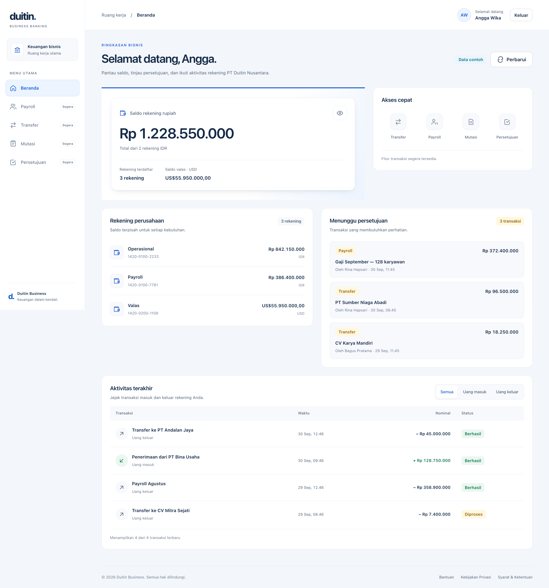

# duidtin-feature-beranda

[English](README.md) · **Bahasa Indonesia**



Beranda (dashboard korporat) yang di-expose sebagai remote Module Federation dan dirender host `duidtin-ui` di route `/`.

Repo ini **satu-satunya repo duidtin yang bukan React** — Vue 3 + Rsbuild, sementara host, layout, dan feature-auth React. Tujuannya membuktikan klaim terkuat Module Federation: remote boleh beda **framework**, bukan cuma beda toolchain. Dan komponennya tetap komponen design-system yang sama, dipakai lewat pembungkus Web Component `<dtn-*>`.

## Cara mulai

Repo ini konsumen `duidtin-ui-design-system`. Untuk melihat beranda di dalam layout, empat server harus nyala:

1. `../duidtin-ui-design-system/` → `bun run dev:producer` (`:3001`)
2. `../duidtin-ui-layout/` → `bun run dev` (`:3002`)
3. Folder ini → `bun install` lalu `bun run dev` (`:3003`)
4. `../duidtin-ui/` → `bun run dev` (`:3000`) ← **buka ini**

Beda dari versi Next-nya, `http://localhost:3003/beranda` sekarang menampilkan **berandanya yang sebenarnya**, bukan halaman guard — cukup design-system di `:3001` yang nyala. Lihat bagian [Kontrak dengan host](#kontrak-dengan-host).

## Status saat ini

Sudah diverifikasi di browser sungguhan (host `:3000` dan berdiri sendiri `:3003`, nol error di console):

- `./base` mengembalikan fungsi `mount(el)`; host React memanggilnya lewat `components/federation/remote-mount.tsx`. **Vue dirender di dalam pohon React tanpa satu pun adaptor framework.**
- Lima blok tampil: 5 `<dtn-card>`, 10 `<dtn-badge>` (semua teksnya utuh), 3 rekening, 4 baris tabel.
- **`useAuth()` versi Vue membaca store sesi yang dipasang host React** — judulnya berbunyi "Selamat datang, Angga." tanpa satu props pun dilewatkan host. Ini bukti paling langsung bahwa `@duidtin/auth` memang framework-agnostik.
- Store Zustand jalan dari Vue: ikon mata menyembunyikan saldo, filter aktivitas memotong 4 baris jadi 1.
- `press` dari `<dtn-button>` ditangkap Vue (`@press`), dan `:is-disabled` masuk sampai ke komponen React di dalamnya — tombol Perbarui berubah jadi "Memperbarui" dan nonaktif.
- `?gagal=rekening,aktivitas` → 3 blok gagal dengan tombol "Coba lagi", banner global muncul, blok persetujuan tetap tampil.
- `?lambat=20` → kerangka muncul dengan jumlah baris yang benar (2 / 5 / 5 / 5).

Belum ada:

- Backend sungguhan. Datanya dummy, tapi bentuknya sudah menyerupai respons API — yang perlu diganti nanti cuma `services/api/client.ts`.
- Peran. Pintasan masih `disabled` semua.
- i18n dan config container (Docker).

## Aturan ngoding di repo feature

Tiga aturan yang berlaku di semua repo `duidtin-feature-*`. Tujuannya menjaga repo feature tetap tipis dan seragam. Di repo ini istilahnya "composable", tapi aturannya sama persis dengan repo React.

### 1. Semua aksi dan logika per-section lewat composable

Komponen **hanya merender**. Tidak ada `useQuery`, tidak ada handler, tidak ada perhitungan di dalamnya. Satu section = satu composable.

```vue
<!-- ❌ jangan -->
<script setup lang="ts">
const { data } = useQuery({ queryKey: …, queryFn: … });
const total = computed(() => (data.value ?? []).reduce((a, b) => a + b.saldo, 0));
</script>

<!-- ✅ begini -->
<script setup lang="ts">
const { total, jumlahRekening, isLoading, isError, retry } = useRingkasanSaldo();
</script>
```

**Kenapa:** komponen jadi bisa dibaca sekilas; logikanya bisa diuji tanpa merender; dan waktu sumber datanya diganti (dummy → API sungguhan), template-nya tidak perlu disentuh sama sekali.

### 2. State ke Zustand, bukan `ref` di komponen

**Kenapa:** state yang dipakai lintas blok (filter periode, rekening terpilih) tidak perlu diangkat lewat props. Dan khusus di MFE, state yang hidup di store bisa bertahan waktu host me-*unmount* lalu me-*mount* ulang remote-nya — dengan `ref` di komponen, semuanya hilang.

Zustand-nya `zustand/vanilla` (paket utamanya membawa hook React), dengan jembatan enam baris di [`utils/zustand-vue.ts`](utils/zustand-vue.ts). Pola yang sama dipakai `@duidtin/auth/vue`.

### 3. UI dari design-system, jangan bikin komponen reusable lokal

Kalau komponen yang dibutuhkan belum ada, **buat dulu di `duidtin-ui-design-system`** — jangan di repo feature.

| Boleh ada di repo feature | Tempatnya di design-system |
|---|---|
| Komposisi khas fitur ini (blok beranda) | Primitif UI (tombol, kartu, skeleton) |
| Composable & store fitur | Pola yang dipakai lintas fitur (empty state, data state) |

**Kenapa:** komponen reusable yang dibuat lokal akan terduplikasi di tiap feature, dan design-system kehilangan gunanya.

### Kondisi saat ini: ketiganya sudah dipatuhi

| Aturan | Bentuknya di repo ini |
|---|---|
| 1 | `composables/use-*.ts` — satu per blok. Komponen di `blocks/` cuma merender |
| 2 | `stores/error-global.ts`, `stores/tampilan-beranda.ts` — Zustand, tidak ada `ref` state di komponen |
| 3 | `<dtn-card>`, `<dtn-badge>`, `<dtn-button>`, `<dtn-alert>`, `<dtn-skeleton>`, `<dtn-data-state>` semuanya dari design-system |

**Satu pengecualian yang disepakati dan satu yang terpaksa:**

- `buatQueryClient()` dipanggil di dalam `mount()`, bukan di modul. Itu bukan state aplikasi melainkan **wadah instance** — kalau global, cache lama akan menempel waktu host me-*mount* ulang remote ini.
- `containers/beranda/components/error-boundary.vue` **komponen lokal walaupun aturan 3 melarang**. Alasannya ada di [bagian error](#tiga-lapis-penanganan-error): `ErrorBoundary` design-system tidak bisa dibungkus jadi Web Component, dan mekanisme Vue-nya berbeda sama sekali.

**Efek samping yang menyenangkan dari aturan 2:** `QueryCache.onError` hidup di luar komponen, jadi dia tidak bisa memakai composable. Dengan store, dia cukup memanggil `storeErrorGlobal.getState().setPesan(...)`.

## Stack — dan kenapa berbeda

| | Pilihan | Alasan |
|---|---|---|
| Framework | **Vue 3.5** | membuktikan remote boleh beda framework, bukan cuma beda bundler |
| Bundler | **Rsbuild 1.x** | tanpa Next: beranda tidak butuh routing maupun SSR, dia cuma dirender host |
| Plugin MF | `@module-federation/rsbuild-plugin` **0.24.1** | versi **sama persis** dengan design-system, remote yang paling sering diajak bicara repo ini |
| Komponen UI | `<dtn-*>` Web Component | komponen React design-system, dipakai tanpa React di sisi ini |
| React | **tidak dipasang** | lihat [Kenapa tidak ada React](#kenapa-tidak-ada-react-di-dependensi) |
| Data | `@tanstack/vue-query` 5 | `QueryClient` milik repo ini sendiri |
| Sesi | `@duidtin/auth` + subpath `/vue` | store yang sama dengan host |
| Styling | Tailwind v4, prefix `fber` | pola BEM + `@apply`, sama dengan layout (`lyt`) dan host (`app`) |
| Port / base | 3003 / `/beranda` | |

## Struktur folder

```
duidtin-feature-beranda/
  expose/
    base.ts              # YANG DI-EXPOSE sebagai "./base" — mount(el) → unmount
  entry/
    dev.ts               # entry halaman dev; batas asinkron MF
    dev-app.ts           # memanggil mount() yang sama seperti host
  containers/beranda/
    index.vue            # rangka halaman: 5 blok + 3 lapis error
    blocks/*.vue         # ATURAN 1 — komponen cuma merender
    components/
      error-boundary.vue # onErrorCaptured, pengganti ErrorBoundary React
      page-heading.vue   # memakai useAuth() versi Vue
      global-error-banner.vue
      icon.vue · format.ts
  composables/           # ATURAN 1 — satu per blok
    use-ringkasan-saldo.ts · use-rekening-perusahaan.ts
    use-antrean-persetujuan.ts · use-aktivitas-terakhir.ts · use-page-heading.ts
  stores/                # ATURAN 2 — zustand/vanilla
    error-global.ts · tampilan-beranda.ts
  services/
    federation.ts        # registrasi design-system + muat pembungkus <dtn-*>
    query-client.ts · api/client.ts · api/beranda.ts
  utils/
    index.ts             # getBaseFederationUrl()
    zustand-vue.ts       # jembatan store → ref
  types/
    global.d.ts          # window.__DUIDTIN_REMOTE_ENTRY__ (diisi host)
    dtn-elements.d.ts    # tipe <dtn-*> untuk vue-tsc
  styles/
    globals.css          # @import tailwindcss prefix(fber) + beranda.css — di-expose "./globals"
    beranda.css          # kelas BEM + @apply
  index.html             # halaman dev
  rsbuild.config.ts · postcss.config.mjs
  vercel.json            # buildCommand + outputDirectory + ignoreCommand
```

## Kontrak dengan host

Host itu aplikasi React. React tidak bisa merender komponen Vue, dan sebaliknya. Yang bisa diseberangkan cuma **DOM**, jadi kontraknya dibalik: yang di-expose bukan komponen, tapi fungsi.

```ts
// expose/base.ts — sisi remote
export const mount = (el: HTMLElement): (() => void) => { … };

// components/federation/remote-mount.tsx — sisi host
const lepas = mount(wadah.current);   // di dalam useEffect
return () => lepas();                 // saat cleanup
```

Host cuma tahu "ada `<div>` kosong, panggil fungsi ini". Remote Svelte atau Angular nanti memakai `RemoteMount` yang sama tanpa satu baris pun berubah di host.

Konsekuensi yang perlu diingat: **semua yang harus jalan di dua-duanya ditaruh di `expose/base.ts`**, bukan di `entry/`. Waktu dirender host, `entry/` tidak pernah dieksekusi. Ini pelajaran mahal dari versi React-nya, yang sempat menaruh pendaftaran remote di `pages/_app.tsx` dan membuat seluruh komponen design-system hilang **tanpa satu pun pesan error**.

## Komponen: `<dtn-*>`, bukan komponen React

```
services/federation.ts
  init({ name: "duidtin_feature_beranda", remotes: [design-system] })
  ├─ loadRemote("duidtin_ui_design_system/globals")                 → token --dtn-* + kelas ui-*
  └─ loadRemote("duidtin_ui_design_system/component-wrapper/semua")  → customElements.define("dtn-card", …)
        └─▶ setelah itu <dtn-card> dipakai di template Vue seperti tag HTML biasa
```

`./components/<n>` **tidak dipakai** di repo ini — isinya komponen React. Yang dipakai `./component-wrapper/semua`, modul yang cuma punya efek samping: mendaftarkan elemennya. Di dalam tiap elemen ada React root yang menjalankan komponen aslinya, dengan kelas CSS yang sama persis.

| Hal | Bentuknya |
|---|---|
| Props | atribut kebab-case — `:is-disabled="isFetching"`, `:lines="5"` |
| Event | `CustomEvent` yang menggelembung — `@press`, `@retry` |
| Isi | anak biasa di light DOM — `<dtn-badge>Data contoh</dtn-badge>` |
| Tipe | `types/dtn-elements.d.ts`, ditulis manual (lihat di bawah) |

Tiga hal yang harus disadari:

**1. `isCustomElement` wajib.** Di `rsbuild.config.ts`, kompiler Vue diberi tahu bahwa `dtn-*` itu elemen, bukan komponen. Tanpa itu Vue memperingatkan "Failed to resolve component" dan — lebih penting — mengirim nilainya sebagai properti DOM, bukan atribut, sehingga `attributeChangedCallback` pembungkusnya tidak pernah jalan.

**2. Prop yang berupa ReactNode tidak bisa lewat.** `loadingFallback` milik `DataState` itu elemen React; tidak ada bentuk atributnya. Jadi keadaan MEMUAT ditangani `v-if` di Vue, dan `<dtn-data-state>` dipakai untuk apa yang memang bisa diatribusikan: kosong dan gagal.

**3. Tipenya manual, tidak dari `@mf-types`.** Arsip tipe design-system berisi tipe **React** (`ComponentProps<typeof Button>`) — tidak berlaku di template Vue. Jadi `scripts/ambil-tipe-design-system.ts`, `fflate`, dan devDependency `react-aria-components` + `tailwind-variants` semuanya ikut terhapus dari repo ini, digantikan `types/dtn-elements.d.ts` yang mendeklarasikan `GlobalComponents`. Harganya: kalau varian di design-system bertambah, berkas itu yang harus menyusul manual.

### Kenapa tidak ada React di dependensi

Padahal `<dtn-*>` menjalankan React di dalamnya. Kuncinya di sisi design-system: dia menshare `react` dan `react-dom` sebagai singleton **dengan fallback**, jadi

```
dirender host   → share scope sudah punya React milik host  → itu yang dipakai
dibuka sendiri  → share scope kosong                         → salinan bawaan design-system
```

Karena itu `shared: {}` di `rsbuild.config.ts` memang kosong, dan repo ini nol baris React. Ini kesimpulan yang baru terbukti setelah memeriksa `mf-manifest.json` design-system — dugaan awalnya justru sebaliknya, bahwa React harus dititipkan dari sini.

## Sesi: `useAuth()` versi Vue

```ts
import { useAuth } from "@duidtin/auth/vue";

const { user } = useAuth();   // user.value, atau {{ user?.nama }} di template
```

Store-nya `zustand/vanilla` yang diparkir host di `window.__DUIDTIN_AUTH__`. Yang berbeda dari versi React cuma cara berlangganannya (±25 baris di paket auth); status, timer kedaluwarsa, `localStorage`, dan interceptor axios-nya identik. Login lewat modal React di host membuat sapaan di beranda ikut berubah, tanpa props.

Paket auth dipasang lewat `file:../duidtin-packages/auth`, dan `dist`-nya tidak masuk git — karena itu ada `prebuild` yang membangunnya dulu, sama seperti host.

## Config Module Federation

```ts
pluginModuleFederation({
  name: "duidtin_feature_beranda",
  filename: "static/remoteEntry.js",
  exposes: {
    "./base": "./expose/base.ts",
    "./globals": "./styles/globals.css",   // CSS langsung, tanpa dikompilasi jadi string
  },
  shared: {},                               // lihat "Kenapa tidak ada React"
  dts: false,                               // tidak ada yang mengonsumsi tipe remote ini
})
```

`entryPath` di registry host ikut berubah: `/beranda/static/remoteEntry.js`, tanpa segmen `_next/static/chunks` — pola yang sama dengan design-system, yang juga bukan Next.

**`remotes` build-time tetap dikosongkan.** Pendaftaran design-system cuma runtime — pelajaran dari `duidtin-ui-layout`: kalau nama yang sama didaftarkan build-time **dan** runtime, yang build-time menang dan yang runtime dibuang diam-diam, sehingga URL dev ikut ke-bake sampai production.

**`dev.hmr` dan `dev.liveReload` dimatikan.** Dev client rsbuild yang ikut ke-inject di `remoteEntry.js` akan memanggil `location.reload()` di halaman **konsumen** — hasilnya halaman host reload terus dan komponen remote tidak pernah sempat kerender. Alasan yang sama dengan design-system.

### Dimuat dari host produksi saat dev

Jalankan `bun run dev` di repo ini, lalu buka `https://super-apps-duidtin.vercel.app/?remote-lokal=duidtin_feature_beranda@3003`. Rinciannya di README host, bagian *Dev tanpa menyalakan semua server*.

> **Butuh host yang sudah di-deploy ulang.** `entryPath` ke-bake di bundle host, jadi host produksi yang belum diperbarui masih meminta `/beranda/_next/static/chunks/remoteEntry.js` — path Next yang tidak ada lagi di sini, dan hasilnya `remote offline`. Dan seandainya pun ketemu, host lama masih merender `./base` sebagai komponen React, padahal isinya sekarang fungsi `mount()`. Sebelum host baru naik, pakai host lokal (`:3000`).

Dua hal di repo ini yang membuatnya jalan:

- **`server.headers: { "Access-Control-Allow-Origin": "*" }`** di `rsbuild.config.ts`. Ini lebih sederhana dari versi Next-nya, yang butuh `allowedDevOrigins` berisi daftar hostname karena Next 16 menjawab 403 untuk request script `/_next/*` lintas situs.
- **`siapkanDesignSystem()` memakai `window.__DUIDTIN_REMOTE_ENTRY__`** dari host kalau ada. Runtime MF di sini instance sendiri, jadi tanpa itu beranda mendaftarkan design-system ke URL hasil hitungannya sendiri dan tidak ikut override `?remote-lokal` atau mode publish di host.

## Peran ganda

Repo ini **remote buat host**, tapi sekaligus **konsumen remote lain**:

```
duidtin-ui (host, React, MF 0.24.1)
  └─▶ loadRemote("duidtin_feature_beranda/base") → mount(el)
        └─▶ app Vue                              (MF 0.24.1)
              └─▶ loadRemote("duidtin_ui_design_system/component-wrapper/semua")
                    └─▶ duidtin-ui-design-system (React di dalam Web Component)
```

Dua batas repo, dua kali ganti framework (React → Vue → React), dalam satu pohon DOM.

## Styling — Tailwind, prefix `fber`

Pola BEM + `@apply` yang sama dengan layout (`lyt`) dan host (`app`). Warnanya diambil dari token `var(--dtn-*)` milik design-system, jadi Tailwind di sini cuma mengurus tata letak dan ukuran:

```css
.fber-page {
  @apply fber:flex fber:flex-col fber:gap-5;
}
```

Dua bentuk berbeda yang gampang tertukar:

| | Bentuk | Muncul di |
|---|---|---|
| Nama kelas | strip — `fber-page`, `fber-saldo__value` | template dan DOM |
| Utility Tailwind | titik dua — `fber:flex`, `fber:gap-5` | cuma di dalam `@apply` |

Yang kedua itu format bawaan Tailwind v4 untuk `prefix(fber)`.

### Yang ikut terhapus bersama Next

Versi Next-nya harus mengompilasi Tailwind jadi **string** lewat `scripts/build-styles.ts`, karena Next melarang import CSS global dari berkas selain `pages/_app.tsx` — dan modul yang di-expose MF jelas bukan `_app.tsx`. Rsbuild tidak punya larangan itu:

```
styles/globals.css  →  exposes: { "./globals": "./styles/globals.css" }
```

Satu berkas config, nol skrip pembangkit, nol berkas hasil generate yang harus di-gitignore. Tailwind masuk lewat `postcss.config.mjs` yang otomatis dibaca Rsbuild.

## Flow aplikasi & data

### 1. Flow aplikasi — dari host sampai blok tampil

```
Browser buka localhost:3000/
  └─▶ host duidtin-ui — pages/index.tsx
        │  FASE 2 host sudah memanaskan container lebih dulu:
        │    loadRemote("duidtin_feature_beranda/globals")   → <style> fber-*
        │
        │  <RemoteMount modul="duidtin_feature_beranda/base" />
        ▼
      expose/base.ts — mount(el)
        ├─ siapkanDesignSystem()                      ← DITUNGGU sebelum app dipasang
        │    ├─ init({ name: "duidtin_feature_beranda", remotes: [design-system] })
        │    ├─ loadRemote(".../globals")              → token --dtn-* + kelas ui-*
        │    └─ loadRemote(".../component-wrapper/semua") → <dtn-*> terdaftar
        ├─ createApp(Beranda)
        ├─ app.use(VueQueryPlugin, { queryClient: buatQueryClient() })
        └─ app.mount(el)
             └─▶ containers/beranda/index.vue
                  ├─ <PageHeading>                    → usePageHeading() + useAuth()
                  ├─ <GlobalErrorBanner>              → store error-global
                  ├─ ErrorBoundary › <RingkasanSaldo>     → useRingkasanSaldo()
                  ├─ ErrorBoundary › <Pintasan>           → statis, tanpa query
                  ├─ ErrorBoundary › <RekeningPerusahaan> → useRekeningPerusahaan()
                  ├─ ErrorBoundary › <AntreanPersetujuan> → useAntreanPersetujuan()
                  └─ ErrorBoundary › <AktivitasTerakhir>  → useAktivitasTerakhir()
```

Design-system **ditunggu** sebelum app-nya dipasang. Elemen `<dtn-*>` yang belum terdaftar sebenarnya akan naik kelas sendiri begitu `customElements.define` jalan, jadi merender lebih dulu pun tidak rusak — cuma sekejap terlihat konten tanpa gaya. Menunggu lebih murah daripada kedipan itu, apalagi containernya biasanya sudah hangat dari FASE 2.

### 2. Flow data — satu query dari mock sampai layar

Contoh: query `rekening` menuju blok Ringkasan saldo.

```
mocks/beranda.ts
  rekeningDummy: Rekening[]            3 rekening — 2 IDR, 1 USD
  │
services/api/beranda.ts
  ambilRekening() → apiGet("rekening", rekeningDummy)
  │
services/api/client.ts — apiGet(endpoint, data)
  ├─ tunggu(acak(500, 1100) × pengaliLambat())     ← ?lambat=N
  ├─ endpoint ada di ?gagal=… → throw new ApiError(endpoint, 503)
  └─ return data                                    → Promise<Rekening[]>
  │
TanStack Vue Query
  useQuery({ queryKey: ["beranda", "rekening"], queryFn: ambilRekening })
  cache per queryKey · retry 1 · staleTime 60 detik · tidak refetch saat jendela fokus
  │
composables/use-ringkasan-saldo.ts     ← mengolah, komponen tidak menghitung apa pun
  computed(() => data.value ?? [])  →
    total                = Σ saldo IDR   → 1.228.550.000
    totalValas           = Σ saldo USD   → 55.950.000
    jumlahRekening       = 3
    jumlahRekeningRupiah = 2 · jumlahRekeningValas = 1
    isLoading = isPending · isError · isEmpty · retry()
  + dari store tampilan-beranda: terlihat, toggleSaldo
  │
containers/beranda/blocks/ringkasan-saldo.vue   ← cuma merender
  v-if="isLoading" → <dtn-skeleton> + <dtn-skeleton-lines :lines="2">
  v-else           → <dtn-data-state :is-empty :is-error @retry>
                       {{ terlihat ? rupiah(total) : "••••••••" }}
```

Semuanya `computed`, bukan variabel biasa: `data` dari vue-query itu ref, jadi hitungan yang dibaca satu kali akan beku di nilai pertama (biasanya `undefined`).

Saldo IDR dan USD **tidak dijumlahkan** — keduanya ditampilkan terpisah, karena menjumlahkan beda mata uang butuh kurs.

Peta lengkap query ke blok:

| `queryKey` | Fungsi | `?gagal=` | Composable | Blok |
|---|---|---|---|---|
| `["beranda", "rekening"]` | `ambilRekening` | `rekening` | `useRingkasanSaldo`, `useRekeningPerusahaan` | Ringkasan saldo, Rekening perusahaan |
| `["beranda", "persetujuan"]` | `ambilPersetujuan` | `persetujuan` | `useAntreanPersetujuan` | Antrean persetujuan |
| `["beranda", "aktivitas"]` | `ambilAktivitas` | `aktivitas` | `useAktivitasTerakhir` | Aktivitas terakhir |

Baris pertama yang paling penting: dua composable memakai `queryKey` yang sama, jadi TanStack menggabungkannya jadi **satu request** — dan keduanya selalu gagal atau berhasil bersamaan.

### 3. Flow aksi pengguna

```
Klik ikon mata — Ringkasan saldo
  toggleSaldo()                               composable → store
  └─▶ storeTampilanBeranda: saldoTerlihat = !saldoTerlihat
        └─▶ bacaStore() memperbarui ref → template re-render → "••••••••"
  Tidak ada request. State bertahan walau host me-mount ulang remote ini.

Klik filter Semua / Masuk / Keluar — Aktivitas terakhir
  setFilter("masuk")                          = pilihFilterAktivitas
  └─▶ store: filterAktivitas = "masuk"
        └─▶ computed: ditampilkan = aktivitas.filter(item.arah === filter)
              └─▶ "Menampilkan 1 dari 4 transaksi"
  Tidak ada request — yang disaring data yang sudah ada di cache.

Klik Perbarui — PageHeading
  <dtn-button @press="perbarui">
  └─▶ React Aria onPress → CustomEvent("press") menggelembung → handler Vue
        └─▶ queryClient.invalidateQueries({ queryKey: ["beranda"] })
              └─▶ ketiga query berprefiks "beranda" refetch bersamaan
  useIsFetching(...) > 0 → :is-disabled → atribut is-disabled → komponen React nonaktif
```

Saat **Perbarui**, kerangka tidak muncul. `isPending` hanya bernilai `true` kalau belum ada data sama sekali; saat refetch, data lama tetap tampil sampai data baru datang.

### 4. Flow gagal — satu endpoint mati

```
localhost:3000/?gagal=rekening
  apiGet("rekening") → throw ApiError("rekening", 503)
  └─▶ TanStack retry 1× → masih gagal
        │
        ├─▶ QueryCache.onError                 sekali per query gagal
        │     ├─ console.error("[beranda] query gagal: rekening")
        │     └─ storeErrorGlobal.getState().setPesan("Sebagian data gagal dimuat (rekening)…")
        │           └─▶ <GlobalErrorBanner> tampil · "Tutup" → bersihkan()
        │
        └─▶ composable: isError = true
              ├─ Ringkasan saldo     → <dtn-data-state> gagal + "Coba lagi" → refetch()
              └─ Rekening perusahaan → sama, karena queryKey-nya sama
            Antrean persetujuan & Aktivitas terakhir tetap tampil — queryKey berbeda.

Komponen crash saat render — bug, bukan API
  └─▶ <ErrorBoundary title="…"> milik blok itu yang menangkap → blok lain tetap tampil
```

`QueryCache.onError` hidup di luar komponen, jadi dia menulis ke store lewat `getState()`.

## Data: TanStack Query + API palsu

### Kenapa `QueryClient` milik repo ini sendiri

Bukan dibagi dari host. Konsekuensinya cache tidak dibagi antar feature remote — kalau nanti dua fitur mengambil data yang sama, dua-duanya fetch sendiri. Ditukar dengan kemandirian: host tidak perlu tahu apa pun soal TanStack Query, dan repo ini bisa ganti versi tanpa mengganggu siapa pun.

Di sini pertukaran itu bahkan tidak punya pilihan lain: host memakai `@tanstack/react-query`, repo ini `@tanstack/vue-query`. Dua paket berbeda, jadi share scope pun tidak bisa menyatukannya.

### API palsu

```
mocks/beranda.ts        data dummy, bentuknya seperti respons API sungguhan
services/api/client.ts  transport: delay + simulasi gagal
services/api/beranda.ts fungsi query + queryKeys
```

Semua akses data lewat `apiGet()`, jadi begitu backend siap yang diganti cuma isi fungsi itu — komponennya tidak perlu disentuh.

**Dua parameter URL untuk menguji keadaan yang susah ditangkap:**

| Parameter | Efek |
|---|---|
| `?gagal=aktivitas` | paksa endpoint itu gagal. Bisa beberapa: `?gagal=aktivitas,persetujuan` |
| `?lambat=30` | perlambat semua endpoint 30× supaya kerangka sempat terlihat |

Sengaja deterministik lewat URL, **bukan gagal acak** — gagal acak bikin frustrasi saat development dan susah didemokan.

## Tiga lapis penanganan error

| Lapis | Menangani | Di mana |
|---|---|---|
| 1. `<dtn-data-state>` | query **gagal** — per blok | dari design-system |
| 2. `<ErrorBoundary>` | **crash saat render** — per blok | `containers/beranda/components/error-boundary.vue` |
| 3. `<GlobalErrorBanner>` | semua query gagal, terpusat | lewat `QueryCache.onError` |

Lapis 1 dan 2 menangani kegagalan yang berbeda: query gagal ≠ komponen crash. Keduanya dipasang **per blok**, bukan per halaman, supaya satu blok yang bermasalah tidak menjatuhkan blok lain.

Lapis 2 satu-satunya yang **tidak** datang dari design-system, dan itu bukan kelalaian. `ErrorBoundary` sengaja tidak dibungkus jadi `<dtn-error-boundary>`: error boundary React hanya menangkap error di dalam pohon React-nya sendiri, sedangkan anak yang di-slot lewat light DOM bukan bagian pohon itu — elemennya akan *terlihat* bekerja padahal tidak menangkap apa pun. Vue punya mekanismenya sendiri, dan justru lebih sederhana: satu `onErrorCaptured`, tanpa class component. Markup fallback-nya memakai kelas CSS design-system yang sama, jadi tampilannya tetap seragam.

> Keterbatasan yang diketahui: banner global menampilkan **pesan terakhir** saja. Kalau dua endpoint gagal bersamaan, yang disebut cuma satu. Cukup untuk memberi tahu "ada yang tidak beres", tidak untuk mendaftar semuanya.

Host juga punya `RemoteErrorBoundary`, tapi itu membungkus SELURUH isi aplikasi — satu crash mengganti seluruh halaman. Yang di sini lebih halus.

## Ganjalan yang ketemu (dan kenapa fix-nya begitu)

1. **`<dtn-badge>Data contoh</dtn-badge>` tampil KOSONG — dan ini bug di design-system, bukan di sini.**
   Pembungkusnya menempatkan anak asli ke dalam slot hasil render React, dan pembacaan `ref.current`-nya dijalankan lewat `queueMicrotask` setelah `render()`. Itu terlalu cepat: root React 18 merender asinkron, jadi saat microtask-nya jalan slot-nya belum ada dan anak asli disembunyikan **selamanya**. Yang lolos cuma elemen yang kebetulan kena perubahan atribut sesudahnya — `<dtn-button>` terlihat benar hanya karena `is-disabled`-nya berubah dan render kedua menemukan slot dari commit pertama.
   Fix di `component-wrapper/utils/inti.ts`: ganti `createRef` jadi **callback ref** dengan identitas stabil, yang dipanggil React tepat saat commit. Sekaligus menutup kasus sebaliknya — komponen yang tidak merender slot (mis. `DataState` saat kosong/gagal) menerima `ref(null)`, jadi anaknya disembunyikan dengan benar.

2. **`lines` dipasang di elemen yang salah.** `<dtn-skeleton-lines>` mengabaikan `lines` karena codegen pembungkus cuma mengenal props untuk elemen induk; `lines` malah nempel di `<dtn-skeleton>` yang tidak memakainya. Fix: `propsBagian` di `peta.ts` design-system, supaya bagian compound boleh punya props sendiri. Sekarang `:lines="5"` benar-benar menghasilkan 5 balok.

3. **Dugaan "Vue harus menitipkan React" ternyata salah.** Rencana awal memasang `react` + `react-dom` sebagai dependensi repo ini dan menshare-nya sebagai singleton, dengan alasan `<dtn-*>` butuh React. Setelah memeriksa `mf-manifest.json` design-system: dia sudah menshare keduanya **dengan fallback** bawaan. Jadi `shared: {}` kosong itu benar, dan repo ini nol baris React — 1 MB lebih ringan dari rencana.

4. **Plugin MF mencoba membuat berkas tipe dan gagal.** `[ Module Federation DTS ] Failed to generate type declaration` — `tsc` tidak bisa mengemit `.d.ts` dari berkas `.vue`. Karena tidak ada yang mengonsumsi tipe remote ini (host memakainya lewat kontrak `mount(el)`), `dts: false` adalah jawaban yang benar, bukan sesuatu yang perlu ditambal.

5. **`isCustomElement` tidak opsional.** Tanpa opsi itu Vue menganggap `dtn-card` komponen yang belum terdaftar. Selain peringatan di console, efek yang lebih halus: nilainya dikirim sebagai properti DOM, bukan atribut — dan pembungkusnya cuma memantau atribut.

6. **Klik `.click()` pada `<dtn-button>` di dalamnya memang bekerja.** Awalnya diduga perlu mensimulasikan pointer event karena React Aria memakai `usePress`. Ternyata tidak: satu `click()` sudah menghasilkan `CustomEvent("press")` yang menggelembung sampai ke handler Vue. Diverifikasi lewat CDP.

## Langkah berikutnya

- Endpoint beranda sungguhan di `duidtin-api` (`rekening`, `persetujuan`, `aktivitas`) menggantikan `mocks/beranda.ts`.
- Isi blok "Menunggu persetujuan" dan "Aktivitas terakhir" begitu fitur Payroll dan Mutasi ada.
- Sambungkan pintasan ke route sungguhan (sekarang semuanya nonaktif).
- Peran: maker melihat pintasan berbeda dari checker.

## Revamp Business Banking

Beranda menonjolkan saldo IDR, saldo USD terpisah, rincian rekening, antrean persetujuan, dan tabel transaksi dengan filter masuk/keluar. `saldo` ditampilkan dalam mata uang asli rekening; saldo beda mata uang tidak dijumlahkan tanpa kurs. Tombol Perbarui memuat ulang seluruh query beranda. Visibilitas saldo ringkasan dan filter transaksi disimpan di `stores/tampilan-beranda.ts`, dengan aksi melalui composable setiap bagian. Pintasan tetap nonaktif sampai rute fiturnya tersedia.
