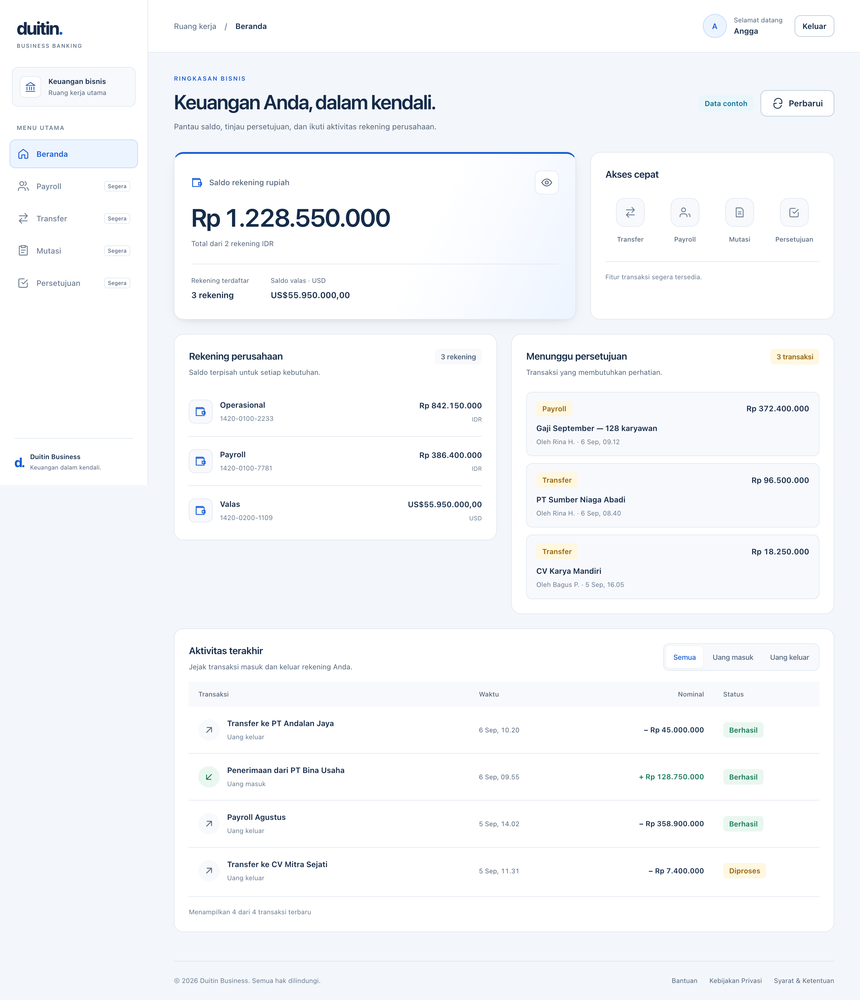

# duidtin-feature-beranda

**English** · [Bahasa Indonesia](README.id.md)



The home page (corporate dashboard), exposed as a Module Federation remote and rendered by the `duidtin-ui` host at route `/`.

This repo is **deliberately built on a different stack from every other duidtin repo** — Next 16 + Rspack + Module Federation 2.x, while the host, layout and design system are still Next 14 / Rslib on MF 0.24.1. The point is to prove Module Federation's central claim: each remote may bring its own toolchain, as long as the contract lines up.

## Getting started

This repo consumes `duidtin-ui-design-system` and is only visible through the host, so three servers must be running:

1. `../duidtin-ui-design-system/` → `bun run dev:producer` (`:3001`)
2. `../duidtin-ui-layout/` → `bun run dev` (`:3002`)
3. This folder → `bun install` then `bun run dev` (`:3003`)
4. `../duidtin-ui/` → `bun run dev` (`:3000`) ← **open this one**

Opening `http://localhost:3003/beranda` only shows a guard page, not the dashboard.

## Current status

Verified working in a browser:

- `./base` is rendered by the host through `loadRemote("duidtin_feature_beranda/base")` at route `/`.
- **MF 0.24.1 and 2.x are proven to talk to each other** — the most important result here, and previously unknown.
- `Card`, `Button`, `Badge` and `Alert` are pulled at runtime from `duidtin_ui_design_system`, so the chain is: host (0.24.1) → beranda (2.x) → design system (0.24.1).
- This is the first feature remote, so **PHASE 2 in the host finally runs for real** — before this, `featureRegistry` was empty and the loop did zero iterations.
- Design-system types are generated into `@mf-types/` automatically — cross-repo `dts` works across MF versions too.

- Five blocks; four of them are data-driven by **three queries** — `rekening` feeds two blocks and TanStack merges it into a single request. Each block owns its loading/error state, so a failing block does not take down blocks whose query is different.
- **Three layers of error handling**, all proven working (see below).

Not there yet:

- A real backend. The data is dummy, but shaped like a real API response — only `services/api/client.ts` needs replacing later.
- Auth and roles. Every shortcut is still `isDisabled`.
- i18n and container (Docker) config. For Vercel, `vercel.json` holds only `ignoreCommand`; the build uses the Next.js defaults set in the dashboard.

## Coding rules for feature repos

Three rules that apply across every `duidtin-feature-*` repo. Their purpose is to keep feature repos thin and uniform.

### 1. Every action and per-section logic goes through a custom hook

Components **only render**. No `useQuery`, no handlers, no calculations inside them. One section = one hook.

```tsx
// ❌ don't
const RingkasanSaldo = () => {
  const { data, isPending } = useQuery({ queryKey: …, queryFn: … });
  const total = (data ?? []).reduce((a, b) => a + b.saldo, 0);
  …
};

// ✅ do
const RingkasanSaldo = () => {
  const { total, jumlahRekening, isLoading, isError, retry } = useRingkasanSaldo();
  …
};
```

**Why:** the component becomes readable at a glance; the logic can be tested without rendering; and when the data source changes (dummy → a real API), the JSX is not touched at all.

### 2. State goes into Zustand, not `useState` in components

**Why:** state used across blocks (a period filter, a selected account) never needs lifting through props. And specifically in an MFE, state that lives in a store survives the host *unmounting* and *remounting* the remote — with `useState` it is all lost.

### 3. UI comes from the design system; never build local reusable components

If a needed component does not exist yet, **create it in `duidtin-ui-design-system` first** — not in the feature repo.

| Belongs in the feature repo | Belongs in the design system |
|---|---|
| Compositions specific to this feature (the beranda blocks) | UI primitives (button, card, skeleton) |
| The feature's hooks & stores | Patterns used across features (empty state, error boundary) |

**Why:** a reusable component built locally will be duplicated in every feature, and the design system loses its purpose.

### Current state: all three are now followed

| Rule | How it looks in this repo |
|---|---|
| 1 | `hooks/use-*.ts` — one hook per block. The components in `blocks/` only render |
| 2 | `stores/error-global.ts` — Zustand, no `useState` in any component |
| 3 | `Skeleton`, `EmptyState`, `ErrorBoundary`, `DataState` all come from the design system |

What used to be `BlockState` in this repo has moved to the design system as `DataState` — it was exactly the kind of component rule 3 forbids building locally.

**One agreed exemption:**

```tsx
const [queryClient] = useState(buatQueryClient);
```

This is not application state but an **instance holder**, and it is React Query's own documented pattern. Moving it into a store would actually be wrong: a single global QueryClient would be shared across mounts, so a stale cache would linger when the host remounts this remote. Exempt from rule 2.

**A pleasant side effect of rule 2:** `QueryCache.onError` lives outside React, so it cannot use hooks. With a store it simply calls `useErrorGlobal.getState().setPesan(...)`. The previous listener-registration mechanism disappeared entirely.

## The stack — and why it differs

| | Choice | Reason |
|---|---|---|
| Framework | Next.js 16.2.9 | exploration; also aligns with `qcash-ui-dashboard-dhe` |
| Bundler | **Rspack** (`next-rspack` 16.2.9) | Turbopack (Next 16's default) **does not support** Module Federation |
| MF plugin | `@module-federation/enhanced` 2.9.0 | `nextjs-mf` stops at Next 14, no Next 15+ support |
| React | 18.3.1 | **must** match the host — it is shared as a singleton |
| Styling | Tailwind v4, prefix `fber` | BEM + `@apply`, the same pattern as the layout (`lyt`) and host (`app`) |
| Data | TanStack Query 5 | a `QueryClient` owned by this repo, not shared from the host |
| Port / basePath | 3003 / `/beranda` | |

## Folder structure

```
duidtin-feature-beranda/
  hooks/                 # RULE 1 — one hook per block
    use-ringkasan-saldo.ts
    use-rekening-perusahaan.ts
    use-antrean-persetujuan.ts
    use-aktivitas-terakhir.ts
  stores/
    error-global.ts      # RULE 2 — Zustand, not useState
  containers/beranda/
    index.tsx            # EXPOSED as "./base"
  scripts/
    build-styles.ts      # compiles Tailwind → a string, see the styling section
  components/remote/
    design-system.tsx    # loadRemote bridge to duidtin_ui_design_system
  services/
    federation.ts        # ← remote registration, see "Snags" item 4
  constants/federation.ts
  types/global.d.ts      # window.__DUIDTIN_REMOTE_ENTRY__ (set by the host)
  utils/index.ts         # getBaseFederationUrl()
  pages/
    _app.tsx             # DELIBERATELY empty
    index.tsx            # guard page
  styles/
    globals.css          # @import tailwindcss prefix(fber) + beranda.css
    beranda.css          # BEM classes + @apply
    global.exposes.ts    # GENERATED, exposed as "./globals" — gitignored
  next.config.ts
  vercel.json            # ignoreCommand only: skip the Vercel build when this folder is unchanged
```

## Module Federation config

No wrapper plugin like `nextjs-mf` — the plugin is installed by hand in the `webpack()` hook:

```ts
import withRspack from "next-rspack";
import { ModuleFederationPlugin } from "@module-federation/enhanced/rspack";

webpack(config, { isServer }) {
  config.cache = false;
  if (!isServer) {                       // the MF container only matters in the browser
    config.optimization.runtimeChunk = false;
    config.output.uniqueName = "duidtin_feature_beranda";
    config.output.chunkLoadingGlobal = "webpackChunkduidtin_feature_beranda";
    config.plugins.push(new ModuleFederationPlugin({ ... }));
  }
  return config;
}
export default withRspack(nextConfig);
```

### Three deliberate departures from `qcash-ui-dashboard-dhe`

This config follows dhe's, but **three things are intentionally different**:

**1. An absolute `assetPrefix`, not `output.publicPath = "auto"`.**
dhe uses `"auto"` and that is correct **there**, because its remote is proxied through the host's origin (`scripts/dev-host-compat.mjs`). The duidtin host proxies nothing, so `"auto"` would make chunks be requested from `:3000` and 404 — exactly the snag `duidtin-ui-layout` already hit. Here it is `assetPrefix: process.env.MF_PUBLIC_PATH`, set to `http://localhost:3003/beranda` in dev and left empty in production.

**2. `shared` is written by hand.**
`nextjs-mf` (used by the host and layout) quietly shares `react`/`react-dom`, which is why they can write `shared: {}`. `enhanced` does **not**:

```ts
shared: {
  react:       { singleton: true, requiredVersion: false },
  "react-dom": { singleton: true, requiredVersion: false },
}
```

Drop those lines and React is duplicated, producing an immediate `Invalid hook call`.

**3. Build-time `remotes` is left empty.**
dhe registers `qui` in its config. Here `remotes` is empty and registration happens only at runtime — the lesson from snag 7 in `duidtin-ui-layout`: if the same name is registered at build time **and** at runtime, the build-time one wins and the runtime one is silently discarded, so the dev URL gets baked all the way into production.

### Loaded from the production host during dev

Beranda can be developed without running the host, layout or design system: run `bun run dev` in this repo, then open `https://super-apps-duidtin.vercel.app/?remote-lokal=duidtin_feature_beranda@3003`. Details in the host README, section *Dev without running every server*. Two things in this repo make it work:

- **`allowedDevOrigins: ["super-apps-duidtin.vercel.app"]`** in `next.config.ts`. Next 16 answers cross-site script requests to `/_next/*` with a 403 unless the Referer hostname is on this list. Tested: the production host's Referer → 200, another domain → 403. It only has an effect in dev.
- **`ensureDesignSystemRegistered()` uses the host's `window.__DUIDTIN_REMOTE_ENTRY__`** when present. The MF runtime here (2.x) has its own registry, so without it beranda would register the design system at a URL it computes itself and would ignore the host's `?remote-lokal` override or publish mode. Opened on its own at `:3003`, that variable is empty and the old path is used.

## A dual role

This repo is a **remote for the host**, and at the same time a **consumer of another remote**:

```
duidtin-ui (host, MF 0.24.1)
  └─▶ loadRemote("duidtin_feature_beranda/base")
        └─▶ containers/beranda/index.tsx        (MF 2.x)
              └─▶ loadRemote("duidtin_ui_design_system/components/card")
                    └─▶ duidtin-ui-design-system  (MF 0.24.1)
```

Two repo boundaries and two MF version crossings inside a single render tree.

## Styling — Tailwind, but by a detour

Tailwind v4 with the `fber` prefix, using the same BEM + `@apply` pattern as the layout (`lyt`) and the host (`app`). Colours come from the design system's `var(--dtn-*)` tokens, so Tailwind here only handles layout and sizing:

```css
.fber-page {
  @apply fber:flex fber:flex-col fber:gap-5;
}
```

Two easily-confused forms:

| | Form | Appears in |
|---|---|---|
| Class names | hyphen — `fber-page`, `fber-saldo__value` | JSX and the DOM |
| Tailwind utilities | colon — `fber:flex`, `fber:gap-5` | only inside `@apply` |

The second is Tailwind v4's native form for `prefix(fber)`.

### Why the CSS cannot simply be `import`ed

**Next forbids importing global CSS from any file other than `pages/_app.tsx`** — and an MF-exposed module (`./globals`) is plainly not `_app.tsx`. Each repo works around this differently:

| Repo | Its workaround |
|---|---|
| `duidtin-ui-layout` | a custom webpack rule (`style-loader`/`css-loader`/`postcss-loader`) |
| `qcash-ui-dashboard-dhe` | compile the CSS into a string, inject it manually via `<style>` |
| **this repo** | **same as dhe** — compiled into a string by `@tailwindcss/cli` |

The pipeline:

```
styles/globals.css                        @import tailwindcss prefix(fber)
  └─▶ scripts/build-styles.ts             runs automatically via predev/prebuild
        └─▶ styles/global.exposes.ts      GENERATED — the CSS as a string
              └─▶ ensureGlobalsStylesheet()   injects <style id="…-globals">
                    └─▶ called by the host in PHASE 2 via loadRemote(".../globals")
```

`styles/global.exposes.ts` is a **generated file** — never edit it by hand, and it is not committed. If the CSS looks stale, run `bun run style`.

## Application & data flow

Four flows, all traced from the code: how beranda reaches the screen, how a single query turns into a figure on screen, what happens when the user presses something, and what happens when the API fails. The reasoning behind each decision lives in [Data](#data-tanstack-query--a-fake-api) and [Three layers of error handling](#three-layers-of-error-handling).

### 1. Application flow — from the host to rendered blocks

```
Browser opens localhost:3000/
  └─▶ host duidtin-ui — pages/index.tsx
        │  the host's PHASE 2 has already warmed the container:
        │    loadRemote("duidtin_feature_beranda/globals")
        │      → styles/global.exposes.ts → ensureGlobalsStylesheet() → <style> fber-*
        │
        │  dynamic(() => loadRemote("duidtin_feature_beranda/base"), { ssr: false })
        ▼
      containers/beranda/index.tsx                     ← exposed as "./base"
        ├─ import components/remote/design-system.tsx
        │    └─ module scope: ensureDesignSystemRegistered()
        │         ├─ init({ name: "duidtin_feature_beranda", remotes: [design-system] })
        │         └─ loadRemote("duidtin_ui_design_system/globals")   → --dtn-* tokens + ui-*
        ├─ useState(buatQueryClient)                   → a QueryClient owned by this repo
        └─ <QueryClientProvider>
             ├─ <PageHeading>                          → usePageHeading()
             ├─ <GlobalErrorBanner>                    → useErrorGlobal store
             ├─ ErrorBoundary › <RingkasanSaldo>       → useRingkasanSaldo()
             ├─ ErrorBoundary › <Pintasan>             → static, no hook & no query
             ├─ ErrorBoundary › <RekeningPerusahaan>   → useRekeningPerusahaan()
             ├─ ErrorBoundary › <AntreanPersetujuan>   → useAntreanPersetujuan()
             └─ ErrorBoundary › <AktivitasTerakhir>    → useAktivitasTerakhir()
```

`pages/_app.tsx` does not appear in this tree because it is **never executed** when the host loads this remote. That is why remote registration and the `QueryClientProvider` sit on a path the container imports.

### 2. Data flow — one query from mock to screen

Example: the `rekening` query feeding the balance summary block.

```
mocks/beranda.ts
  rekeningDummy: Rekening[]            3 accounts — 2 IDR, 1 USD
  │
services/api/beranda.ts
  ambilRekening() → apiGet("rekening", rekeningDummy)
  │
services/api/client.ts — apiGet(endpoint, data)
  ├─ tunggu(acak(500, 1100) × pengaliLambat())     ← ?lambat=N
  ├─ endpoint listed in ?gagal=… → throw new ApiError(endpoint, 503)
  └─ return data                                    → Promise<Rekening[]>
  │
TanStack Query
  useQuery({ queryKey: ["beranda", "rekening"], queryFn: ambilRekening })
  cached per queryKey · retry 1 · staleTime 60 seconds · no refetch on window focus
  │
hooks/use-ringkasan-saldo.ts           ← does the processing; the component computes nothing
  data ?? []  →
    total                = Σ IDR balances  → 1,228,550,000
    totalValas           = Σ USD balances  → 55,950,000
    jumlahRekening       = 3
    jumlahRekeningRupiah = 2 · jumlahRekeningValas = 1
    isLoading = isPending · isError · isEmpty · retry()
  + from the tampilan-beranda store: terlihat, toggleSaldo
  │
containers/beranda/blocks/ringkasan-saldo.tsx   ← only renders
  <DataState isLoading isError isEmpty onRetry={retry} loadingFallback={<Skeleton…/>}>
    terlihat ? rupiah(total) : "••••••••"
```

IDR and USD balances are **not summed** — they are shown separately, because adding different currencies needs an exchange rate.

The full query-to-block map:

| `queryKey` | Function | `?gagal=` | Hook | Block |
|---|---|---|---|---|
| `["beranda", "rekening"]` | `ambilRekening` | `rekening` | `useRingkasanSaldo`, `useRekeningPerusahaan` | Balance summary, Company accounts |
| `["beranda", "persetujuan"]` | `ambilPersetujuan` | `persetujuan` | `useAntreanPersetujuan` | Approval queue |
| `["beranda", "aktivitas"]` | `ambilAktivitas` | `aktivitas` | `useAktivitasTerakhir` | Recent activity |

The first row matters most: two hooks share one `queryKey`, so TanStack merges them into **a single request** — and they always fail or succeed together.

### 3. User action flow

```
Click the eye icon — balance summary
  toggleSaldo()                               hook → store
  └─▶ useTampilanBeranda: saldoTerlihat = !saldoTerlihat
        └─▶ subscribed components re-render → "••••••••"
  No request. The state survives the host remounting this remote.

Click the All / In / Out filter — recent activity
  setFilter("masuk")                          = pilihFilterAktivitas
  └─▶ store: filterAktivitas = "masuk"
        └─▶ hook: ditampilkan = aktivitas.filter(item.arah === filter)
              └─▶ "Menampilkan N dari 4 transaksi"
  No request — it filters data already in the cache.

Click Refresh — PageHeading
  perbarui()
  └─▶ queryClient.invalidateQueries({ queryKey: ["beranda"] })
        └─▶ all three queries prefixed "beranda" refetch at once
  useIsFetching({ queryKey: ["beranda"] }) > 0 → the button reads "Memperbarui", disabled
```

On **Refresh**, no skeleton appears. `isPending` is only `true` when there is no data at all; during a refetch the old data stays on screen until the new data arrives.

### 4. Failure flow — one endpoint goes down

```
localhost:3000/?gagal=rekening
  apiGet("rekening") → throw ApiError("rekening", 503)
  └─▶ TanStack retries 1× → still failing
        │
        ├─▶ QueryCache.onError                 once per failed query
        │     ├─ console.error("[beranda] query gagal: rekening")
        │     └─ useErrorGlobal.getState().setPesan("Sebagian data gagal dimuat (rekening)…")
        │           └─▶ <GlobalErrorBanner> appears · "Tutup" → bersihkan()
        │
        └─▶ hook: isError = true
              ├─ Balance summary   → <DataState> error + "Coba lagi" → refetch()
              └─ Company accounts  → the same, because the queryKey is the same
            Approval queue & Recent activity stay up — different queryKeys.

A component crashes while rendering — a bug, not the API
  └─▶ that block's own <ErrorBoundary title="…"> catches it → other blocks stay up
```

`QueryCache.onError` lives outside React, so it writes to the store through `getState()` — not through a hook.

## Data: TanStack Query + a fake API

### Why the `QueryClient` belongs to this repo

It is not shared from the host. The consequence is that the cache is not shared between feature remotes — if two features later fetch the same data, both fetch it separately. The trade is independence: the host needs to know nothing about React Query, and this repo can change versions without disturbing anyone.

If the cache ever needs sharing, the way is to make `@tanstack/react-query` a shared singleton in the MF config — exactly the pattern React uses today.

### The provider lives IN THE CONTAINER, not `_app.tsx`

```tsx
// containers/beranda/index.tsx
const [queryClient] = useState(buatQueryClient);
return <QueryClientProvider client={queryClient}>…</QueryClientProvider>;
```

Same reason as remote registration: `_app.tsx` is **never executed** when beranda is loaded by the host. A provider placed there only runs when `:3003` is opened directly.

### The fake API

```
mocks/beranda.ts        dummy data, shaped like a real API response
services/api/client.ts  transport: delay + failure simulation
services/api/beranda.ts query functions + queryKeys
```

All data access goes through `apiGet()`, so when a backend arrives only that function's body changes — the components stay untouched.

**Two URL parameters for states that are hard to catch:**

| Parameter | Effect |
|---|---|
| `?gagal=aktivitas` | force that endpoint to fail. Several at once: `?gagal=aktivitas,persetujuan` |
| `?lambat=30` | slow every endpoint 30× so the skeletons are actually visible |

Deliberately deterministic through the URL, **not random failure** — random failures are maddening during development and impossible to demo.

## Three layers of error handling

| Layer | Handles | Where |
|---|---|---|
| 1. `BlockState` | a **failed query** — per block | `containers/beranda/components/block-state.tsx` |
| 2. `ErrorBoundary` | a **render crash** — per block | from the design system, wrapping each block |
| 3. `GlobalErrorBanner` | every failed query, centrally | via `QueryCache.onError` |

Layers 1 and 2 handle genuinely different failures: a failed query is not a crashed component. Both are installed **per block**, not per page, so one troubled block does not take its neighbours down.

Layer 3 is the safety net: the user still learns something is wrong even when the failing block happens to be off-screen.

> Known limitation: the global banner shows only the **most recent** message. If two endpoints fail at once, only one is named. Enough to signal "something is wrong", not to enumerate everything.

The host also has a `RemoteErrorBoundary`, but that wraps the ENTIRE application — one crash replaces the whole page. This one is finer-grained.

## Snags we hit (and why the fixes look like that)

1. **`reactCompiler: { target: "18" }` killed the dev server.** Copied from dhe, it turns out to require `babel-plugin-react-compiler`: `Failed to load the babel-plugin-react-compiler`. Removed — it is an optional optimisation, and React 18 runs on Next 16 without it.

2. **`withRspack` and `--webpack` cannot be combined.** Next 16 defaults to Turbopack, so the first instinct is to add `--webpack`. The result: `Cannot call withRspack and pass the --webpack flag. Please configure only one bundler.` The `withRspack` wrapper alone is enough, with no flag.

3. **The banner prints `(Turbopack)` while Rspack is actually running.** Misleading — the banner is printed before the config is loaded. To confirm Rspack really engaged, look for `[Module Federation Manifest Plugin] Manifest Link:` in the log. If it is absent, the `webpack()` hook never ran and the MF plugin was never installed.

4. **`init()` in `pages/_app.tsx` is never executed — the most deceptive one.**
   First attempt: static text appeared, but **every design-system component was missing**, with no error at all.
   The cause: when beranda is loaded as a remote, the host only fetches the `./base` module. `_app.tsx` is this repo's own Next application entry and is **never run** in the host's context. So registration placed there only works when `:3003` is opened directly.
   `duidtin-ui-layout` escapes this trap not by being right, but because it has build-time `remotes` — which is precisely its own snag 7.
   The fix: registration moved into [`services/federation.ts`](services/federation.ts), called at **module scope** from the bridge file the container imports. That path definitely runs both through the host and standalone.

5. **This repo's MF runtime is a SEPARATE instance from the host's.** A consequence of item 4: the host already registered `duidtin_ui_design_system` in its registry, yet beranda still has to register it again. What instances share is the **shared scope** (React), not the remote registry.

6. **`bun run dev` hangs with no message at all — at the `predev` step.** The log stops at `$ bun run scripts/build-styles.ts` and the dev server never starts.
   The cause: the script originally called `bun x @tailwindcss/cli`. The package is named `@tailwindcss/cli`, but its binary is named `tailwindcss` — they differ. `bun x` does not recognise it as an installed package and silently runs `bun add @tailwindcss/cli@latest --no-cache --force`, downloading from the internet. On a slow or blocked network, that hangs forever.
   The fix: call the local binary directly, `./node_modules/.bin/tailwindcss`. Style build time went from *never finishing* to about 1.7 seconds, with no network.

## Next steps

- Fill the "pending approval" and "recent activity" blocks once the Payroll and Statement features exist.
- Wire the shortcuts to real routes (all of them are `isDisabled` today).
- Auth and roles: a maker should see different shortcuts from a checker.
- Real data replacing the sample figures.

## Business Banking refresh

The dashboard now emphasizes IDR balances, separate USD balances, account details, pending approvals, and a filterable transaction table. `saldo` is displayed in the account's native currency; currencies are never summed without a conversion rate. The header refreshes all dashboard queries. Balance visibility and transaction filters live in `stores/tampilan-beranda.ts`, with actions exposed through each section's hook. Shortcut actions remain disabled until their feature routes are available.
