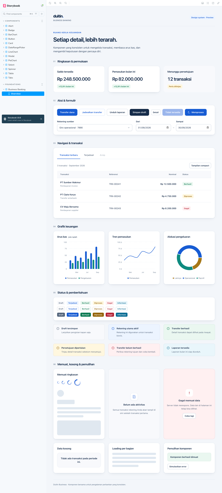

# duidtin-ui-design-system

**English** · [Bahasa Indonesia](README.id.md)



A global component & style library, exposed as a Module Federation remote to be consumed by the host (`duidtin-ui`) and anything else that needs it.

Built with **Rslib**, used for two different purposes in two different folders:

```
duidtin-ui-design-system/
  packages/
    ui/                 # components + styles, an ordinary library (NOT Module Federation)
  apps/
    producer/           # the part that actually becomes an MF remote (loadRemote-able)
```

## Getting started

From the root of this repo (`x-duidtin/duidtin-ui-design-system/`):

1. `bun install` — installs every dependency (root + `packages/ui` + `apps/producer` at once, via workspaces).
2. `bun run build` — builds `packages/ui` first, then `apps/producer` (Turborepo orders this automatically). Output: `dist/` in `packages/ui`, `dist/mf/` (`remoteEntry.js` + manifest) in `apps/producer`.
3. `bun run storybook` — opens the component preview at `localhost:6006`. Quit the server with `q` or Ctrl+C twice (because `turbo.json` uses `"ui": "tui"`).
4. `bun run dev:producer` — starts the `apps/producer` dev server (`--filter=@duidtin/producer --filter=@duidtin/ui`, so `packages/ui` is watched too) and serves `remoteEntry.js` live at `http://localhost:3001/design-system/static/remoteEntry.js` — this is what `duidtin-ui-layout` and the host `duidtin-ui` point at during local development.

## Stack

- **Bun** — package manager & workspace runner (`bun install`, `bun run <script>`).
- **Turborepo** — cross-package task orchestration (`build`, `dev`, `check-types`, `storybook`), automatically ordering builds by inter-package dependencies.
- **TypeScript** — strict mode; each package has its own `tsconfig.json` extending the root one.
- **Rslib** — the main build tool, used two different ways: format `"esm"` for `packages/ui` (an ordinary library package), format `"mf"` (+ `@module-federation/rsbuild-plugin`) for `apps/producer` (the Module Federation remote).
- **React 18** + **react-aria-components** — the accessible component primitives each `packages/ui` component wraps.
- **Tailwind CSS v4** (prefix `ui:`) + **tailwind-variants** + **tailwind-merge** — styling & per-component variant composition.
- **Module Federation** (`@module-federation/rsbuild-plugin`, `@module-federation/typescript`) — the mechanism that exposes components to outside consumers (`duidtin-ui-layout` and the host `duidtin-ui`), including cross-remote TypeScript type generation.
- **Storybook** (Vite builder) — visual preview & documentation, separate from the Module Federation path at runtime. Its static build is also published at `/storybook/`.

## Web Component wrappers (`<dtn-*>`)

Everything in `packages/ui` is a **React** component. So that non-React consumers — the future Vue/Svelte/Angular remotes — can use them too, some are also wrapped as custom elements.

The full list lives in `src/component-wrapper/` itself: a wrapped component has `buatElemen(...)`, while the rest carry a file containing `BELUM_DIBUNGKUS` and the reason. Today 11 are wrapped and 7 are not.

```
<dtn-button color="primary">Masuk</dtn-button>
   │
   └─ custom element (browser)  →  one React root inside  →  <button class="ui-button …">
         HTML attributes → React props
         React onPress   → CustomEvent("press")
```

The key point: **nothing is duplicated**. The element runs the very same React component and produces the very same CSS classes, so `styles/` and `tokens.css` are untouched. Only the interface differs.

```html
<dtn-card variant="elevated">
  <dtn-card-header>Rekening operasional</dtn-card-header>
  <dtn-card-body>Saldo tersedia Rp 842.150.000</dtn-card-body>
</dtn-card>

<dtn-bar-chart category-key="bulan" data='[…]' series='[{"dataKey":"masuk"}]' height="200"></dtn-bar-chart>
```
```js
await loadRemote("duidtin_ui_design_system/component-wrapper/button");  // register one element
await loadRemote("duidtin_ui_design_system/component-wrapper/semua");   // or all of them at once
el.addEventListener("press", () => kirim());
```

### How it works (`component-wrapper/utils/inti.ts`)

No third-party library — the Custom Elements API plus `react-dom/client`:

```
connectedCallback
  ├─ wrap the original children in <span data-dtn-anak>   ← never detached from the document
  ├─ append <span data-dtn-wadah> → createRoot()          ← the ONLY part React owns
  └─ render(<Component {...props}><span ref=slot/></Component>)
        └─ move the children wrapper into the slot         ← light DOM slot
             └─ slot not rendered (e.g. DataState while loading) → children hidden, not removed

attributeChangedCallback → re-render
disconnectedCallback     → unmount DEFERRED by a tick, so a mere move does not destroy the root
```

Two traps hit while building it, written down so they are not repeated:

| Symptom | Cause | Fix |
|---|---|---|
| The button label vanished, `<button>` rendered empty | `createRoot().render()` overwrites the element's content, and `@r2wc/react-to-web-component` never touches `childNodes` | our own factory, which captures the children first — that library was dropped again |
| The elements were not registered at all | `sideEffects` in `packages/ui/package.json` — `customElements.define()` is a pure side effect, and a one-level glob (`/*`) does not reach `button/index.ts` | `"sideEffects": ["./src/component-wrapper/**", "./dist/component-wrapper/**"]` |

**Shadow DOM is deliberately avoided.** The design system's CSS is global and class-based (`ui-button`); a shadow boundary would cut it off and every element would have to inject its own CSS. With the light DOM, the existing `./globals` expose keeps working as-is.

**React is still loaded** on any page using these elements — this wrapper is an interface, not a rewrite. A non-React remote only needs `shared: { react, react-dom: { singleton: true } }` to use the host's React rather than shipping a second one.

### Codegen (`packages/ui/scripts/generate-wrappers.ts`)

Runs automatically through `prebuild`, or by hand: `bun run gen:wrapper`.

| Inferred automatically | From |
|---|---|
| variant names → string attributes | `src/styles/<n>/<n>.styles.ts`, the keys inside `variants: { … }` |
| compound parts → `-part` elements | `Object.assign(Root, { … })` in `src/components/<n>/index.ts` |

| Written by hand, once | Where |
|---|---|
| non-variant props (`isDisabled`, `data`, `isLoading`), events (`onPress` → `press`), the skip list | `src/component-wrapper/utils/peta.ts` |

Output: `component-wrapper/<n>/index.ts` per component, `component-wrapper/index.ts` (registers everything) and `utils/elemen.d.ts` (JSX declarations). All of it is **generated** — do not edit by hand.

## The flow in short

```
packages/ui  (Rslib "esm", an ordinary library)
      │
      ▼  imported as a dependency
apps/producer  (Rslib "mf" + pluginModuleFederation → remoteEntry.js)
      │
      ▼  loadRemote("duidtin_ui_design_system/<name>")
duidtin-ui-layout       (:3002, MF 0.24.1)  ─┐
duidtin-feature-beranda (:3003, MF 2.x)     ─┴─▶  two consumers, two different paths
```

Note this remote is consumed through **two paths at once** on a single page: through the layout (the header) and through a feature remote (the content). The host itself does **not** consume it directly — it is a thin shell that renders no UI components. That is why `react`/`react-dom` must be singletons: otherwise one page could load two React instances via two different routes. And one of those consumers runs on a different MF version line (2.x), which turns out to still share the same scope.

## Architecture flow

Unlike `duidtin-ui-layout`, which plays a dual role, this repo is a **pure remote**: it only exposes and consumes no remote at all. There is no `remotes` in its config, no `init()`, and no `_app.tsx`. Who uses it, and from which URL, is decided entirely **on the consumer's side**.

So the flow is not build → boot → render, but: build the component factory → generate the expose list → build the remote → serve it → get consumed.

### 1. Build `packages/ui` — the component factory

```
packages/ui/rslib.config.ts — two libs in one config
  ├─▶ lib 1: format "esm", bundle: false
  │     entry: ./src/**  (excluding *.stories.tsx and *.css)
  │     → dist/**/*.js + *.d.ts — ONE output file per source file
  └─▶ lib 2: entry src/styles/index.tailwind.css
        → dist/index.tailwind.css
          (@import "tailwindcss" prefix(ui) + tokens.css + every component's CSS)
```

Both outputs are opened up through `exports` in `package.json`: `"."` for the components, `"./css"` for their CSS.

`bundle: false` means **every file is compiled on its own**, not merged into one bundle. Cross-folder imports are still fine: the output becomes an ordinary relative import (`../components/button/index.js`) that resolves when a consumer uses it — which is exactly what `component-wrapper/*/index.ts` does with `components/*`.

> Note: this README used to claim that a cross-folder import makes Rspack panic. Re-tested on Rslib 0.19.5 with two cases — a wrapper file importing a component folder, and a component importing another component — **both build cleanly**. The old claim no longer holds.

### 2. Exposes codegen — `predev` and `prebuild`

```
apps/producer/scripts/generate-components.ts
  └─▶ read the folders in packages/ui/src/components/*
        ├─▶ write a shim apps/producer/src/components/<name>.ts
        │     export { Button } from "@duidtin/ui";
        │     export { Button as default } from "@duidtin/ui";
        └─▶ write component-exposes.ts
              { "./components/button": "./src/components/button.ts", … }   ← 18 React
              { "./component-wrapper/button": "./src/component-wrapper/button.ts", … } ← 19 elements
```

The shims deliberately export **both named and `default`**, so a consumer's `loadRemote` result already matches the shape `next/dynamic` demands (`{ default }`).

Adding a component never touches the MF config — create its folder and the codegen registers it. The step-by-step lives in [Adding a new component](#adding-a-new-component).

### 3. Build `apps/producer` — becoming a Module Federation remote

```
apps/producer/rslib.config.ts — lib format "mf"
  └─▶ pluginModuleFederation({
        name:     "duidtin_ui_design_system",
        filename: "remoteEntry.js",
        exposes:  { ...componentExposes, "./globals": "./src/styles/index.css" },
        shared:   { react, react-dom, react/jsx-runtime } → singleton
        dts:      generateTypes → @mf-types
      }, { target: "dual" })
  └─▶ dist/mf/remoteEntry.js + mf-manifest.json + one chunk per expose
```

Four things worth noticing:

- **`./globals` → `src/styles/index.css`**, whose only content is `@import "@duidtin/ui/css"`. So CSS flows `packages/ui` → `exports["./css"]` → `apps/producer` → exposed. The `--dtn-*` tokens the layout and beranda rely on travel along with it.
- **`react/jsx-runtime` is shared too**, not just `react` and `react-dom`. `nextjs-mf` in the other repos handles that silently; `rsbuild-plugin` does not.
- **`target: "dual"`** produces two builds: `mf` for the browser and `mf-ssr`. It shows up in the dev log as two lines, `built in … (mf)` and `(mf-ssr)`.
- **There is no `remotes`.** This repo consumes nothing — `consumeTypes` is configured, but only as preparation.

### 4. Dev — `bun run dev:producer`

```
turbo run dev --filter=@duidtin/producer --filter=@duidtin/ui
  ├─▶ @duidtin/ui        rslib build --watch --no-clean  → dist/ always fresh
  └─▶ @duidtin/producer
        predev: generate-components.ts
        dev:    MF_PUBLIC_PATH=http://localhost:3001/design-system/static/ rslib mf-dev
                → :3001/design-system/static/remoteEntry.js
                  dev.hmr = false, liveReload = false
```

- **An absolute `MF_PUBLIC_PATH` in dev.** Consumers run on other ports; with a relative path, the chunks are looked up on the consumer's origin and 404. In production it is empty, because every remote shares one domain.
- **`hmr` and `liveReload` are off.** The rsbuild dev client injected into `remoteEntry.js` would call `location.reload()` on the **consumer's** page — the host page reloads endlessly.

### 5. Consumed — in the consumer's browser

```
consumer (duidtin-ui-layout / duidtin-feature-beranda)
  └─▶ init({ remotes: [{ name: "duidtin_ui_design_system",
                         entry: <origin>/design-system/static/remoteEntry.js }] })
  └─▶ loadRemote("duidtin_ui_design_system/globals")
        → CSS (--dtn-* tokens + ui-* classes) lands in a <style>, preventing FOUC
  └─▶ loadRemote("duidtin_ui_design_system/components/card")
        → { Card, default }
        └─▶ compound sub-components (Card.Header) are taken through `pick` —
              static properties are lost when next/dynamic wraps the module
```

This repo has no idea who its consumers are. Remote registration, picking the URL per environment, and `pick` for compound components all happen on the consumer's side. Who the consumers are is shown in [The flow in short](#the-flow-in-short).

### The whole flow in one view

```
build ui       packages/ui — rslib
   │             ├─▶ dist/**/*.js        components, one file per source
   │             └─▶ dist/index.tailwind.css
   │
codegen        predev / prebuild — generate-components.ts
   │             └─▶ 18 React shims + 19 wrapper shims + component-exposes.ts
   │
build remote   apps/producer — rslib format "mf", target dual
   │             └─▶ dist/mf/remoteEntry.js
   │                   exposes 18 React components + 19 wrappers + ./globals
   │                   shared react singleton · types into @mf-types
   │
serve          :3001/design-system/static/
   │             dev: rslib mf-dev (absolute URL) · prod: relative path, one domain
   │
consumed       layout & beranda
                 └─▶ init() → loadRemote(".../globals") → loadRemote(".../components/<name>")
```

Three different moments: the `exposes` list is frozen at **build**, CSS and tokens load when a consumer **boots**, component chunks are fetched at **render**.

> **The easy mix-up:** the `exposes` list is read when the config loads, not watched. `rslib build --watch` in `packages/ui` does refresh components that already exist, but **a new component will not be served until `bun run dev:producer` is restarted** — only then does `predev` regenerate the expose list.

## Adding a new component

From writing the component to having it `loadRemote`-able from outside:

```
1. packages/ui/src/styles/<name>/<name>.styles.ts   → variant definitions (tv())
2. packages/ui/src/styles/<name>/<name>.css          → BEM classes with the "ui-" prefix, @apply Tailwind
3. packages/ui/src/styles/index.tailwind.css          → add @import "./<name>/<name>.css";
        (skip this and the classes exist but the CSS is never compiled/included)
4. packages/ui/src/components/<name>/root.tsx         → the React component, wrapping a react-aria-components
                                                          primitive, using the <name>Variants from step 1
5. packages/ui/src/components/<name>/index.ts          → local barrel: export { Root as <Name> }
6. packages/ui/src/index.ts                            → add: export { <Name> } from "./components/<name>";
        (skip this and the component exists but can't be imported from "@duidtin/ui" directly)

── optional but recommended before moving on ──
7. packages/ui/src/components/<name>/<name>.stories.tsx → check it visually in Storybook (bun run storybook)
                                                            before going on to the MF expose

── build packages/ui ──
8. bun run build (in packages/ui, or from the root through turbo)
        → produces a fresh dist/, including dist/components/<name>/root.js + .d.ts

── expose through apps/producer (AUTOMATIC, see "Exposes codegen" below) ──
9. scripts/generate-components.ts runs automatically before the build (prebuild)
        → scans packages/ui/src/components/*, generates the apps/producer/src/components/<name>.ts shim
          and updates apps/producer/src/components/component-exposes.ts
        (this used to be 2 manual steps — now you just need the component's folder name in
         packages/ui to be right, and the rest is generated)

── build apps/producer ──
10. bun run build (in apps/producer, or from the root — turbo builds packages/ui first because of dependsOn: ["^build"])
        → remoteEntry.js + mf-manifest.json are updated with an expose entry for the new component
        → and the TypeScript types are generated into the @mf-types folder (see "Cross-remote types")

── verify ──
11. check apps/producer/dist/mf/mf-manifest.json — make sure the "./components/<name>" key shows up there
12. start the host (:3000), the layout (:3002) and beranda (:3003), then use the component through
        loadRemote("duidtin_ui_design_system/components/<name>") — verify it really renders in
        the browser with its styles, not merely that the build succeeded
```

The steps easiest to forget are now just 3 and 6 (adding new files in `packages/ui` but forgetting to register them in `index.tailwind.css` / the `index.ts` barrel) — the expose side (steps 9-10, formerly manual) is automated through codegen, so that particular risk is gone.

## Exposes codegen (`apps/producer/scripts/generate-components.ts`)

This script is what removed the manual "write a shim + register it in `component-exposes.ts`" step for every new component:

- Runs automatically through `prebuild` (and at the start of `dev` too) — so when `bun run build` is called in `apps/producer`, this runs before `rslib build`.
- Reads every folder name under `packages/ui/src/components/` and converts it to PascalCase (`button` → `Button`) — this assumes the folder name and the exported component name always line up, which is the convention used from the start.
- Generates the `apps/producer/src/components/<name>.ts` shim, which is nothing but a re-export from `@duidtin/ui`, and regenerates the entire contents of `component-exposes.ts` from the folders it found.
- The consequence: `apps/producer/src/components/component-exposes.ts` and every `<name>.ts` shim in that folder are **generated files**, not hand-written ones — edit them by hand and the next `prebuild` will overwrite you.
- **The Web Component wrappers are generated here too.** The same script reads `packages/ui/src/component-wrapper/*`, writes a shim at `apps/producer/src/component-wrapper/<name>.ts` (its body is `import "@duidtin/ui/component-wrapper/<name>"` — a side-effect import, because what matters is registering the element), plus one `./component-wrapper/semua` entry that registers all of them at once. The total today is 18 React exposes + 19 wrapper exposes + `./globals`.
- The wrappers themselves are generated by another script inside `packages/ui` — see [Codegen](#codegen-packagesuiscriptsgenerate-wrappersts) in the Web Component section.

## Cross-remote types (MF `dts`)

`pluginModuleFederation` in `apps/producer/rslib.config.ts` carries a `dts: { generateTypes, consumeTypes, displayErrorInTerminal }` block (requires the `@module-federation/typescript` devDependency):

- `generateTypes: { extractThirdParty: true, typesFolder: "@mf-types" }` — when `apps/producer` builds, TypeScript type descriptions for everything in `exposes` are generated into the `@mf-types` folder (which is `.gitignore`d, since it is generated output, not source).
- `consumeTypes: { typesFolder: "@mf-types" }` — the other side, used if `apps/producer` itself ever needs to **consume** types from another remote (not relevant yet, since it consumes none, but wired up from the start for consistency).
- `displayErrorInTerminal: true` — if type generation fails, the error shows up clearly in the build terminal instead of failing silently.
- **The archive has to carry `@duidtin/ui`'s declarations, and for a while it did not.** The generated files say `export { Button } from "@duidtin/ui"` — if that package is not inside the archive, the import dangles on the consumer side and `skipLibCheck` quietly turns it into `any`.

### Why the archive was empty, and the fix

```
extractor (@module-federation/third-party-dts-extractor)
  └─ scans every `from "…"` in the generated d.ts
       └─ require.resolve("@duidtin/ui")        ← WITHOUT a `paths` option
            └─ executed from the extractor's folder under node_modules/.bun/…
                 └─ bun's node_modules layout: workspace packages are not visible from there
                      └─ MODULE_NOT_FOUND → swallowed by try/catch → the package is never archived
```

The fix is one line: `"@duidtin/ui": "*"` in the **root package.json** `dependencies`, so bun also links it at the root `node_modules/` — an ancestor of the extractor's location, which makes resolution succeed.

| | Before | After |
|---|---|---|
| `@mf-types.zip` | 7.6 KB | **64 KB** |
| Contents | `compiled-types/`, `components/` | + `node_modules/@duidtin/ui/**` |
| On the consumer | `loadRemote(...)` → `any` | → `ButtonRootProps`, `color: "primary" \| "default"` |

**Consumers need one more step.** `@duidtin/ui`'s declarations reference `react-aria-components`, `tailwind-variants` and `react`, none of which ship inside the archive (qcash has the same gap). Without them installed, `skipLibCheck` loosens the props again. So every consumer repo installs those two as **devDependencies** (types only, never bundled), matching the versions the design system uses.

The alternative that removes that need: writing self-contained public types in `types/*.types.ts` (e.g. an explicit `color?: "primary" | "default"`) instead of extending react-aria-components types. Friendlier for consumers, but it touches 18 type files.

## Component preview (Storybook)

`packages/ui` has its own Storybook (`.storybook/main.ts`, `.storybook/preview.ts`) — **separate** from the Module Federation path at runtime. Storybook imports components straight from `src/` (not through `loadRemote`); its purpose is visual preview & documentation of each component, not part of what `apps/producer`/the host consumes. At runtime `remoteEntry.js` does not depend on Storybook. The only coupling is the Vercel build: `build:vercel` also builds Storybook, so removing Storybook means updating that script too (see the Vercel section below).

- The builder is Vite (`@storybook/react-vite`), not Rslib/Rsbuild — Storybook runs independently of this package's production build pipeline.
- `viteFinal` in `.storybook/main.ts` adds the `@tailwindcss/vite` plugin so Tailwind utility classes (the `ui:` prefix) compile while Storybook runs — without it components render unstyled in Storybook even though the classes are there.
- `.storybook/preview.ts` imports `../src/styles/index.tailwind.css` globally, so every story gets the styles without re-importing them per story file.
- Each component has a `<name>.stories.tsx` file in its own folder (`src/components/button/button.stories.tsx`) containing several "stories" (prop combinations) you can browse one by one in the Storybook UI.
- Run `bun run storybook` in `packages/ui` (after `bun install`) to open the preview at `localhost:6006`.

## `packages/ui` — the component factory

- Built with Rslib format `"esm"` — the output is an ordinary npm package (`dist/` holding ESM + `.d.ts`).
- Not a single line about Module Federation lives here. It can be tested and used standalone.

## `apps/producer` — packaging it as an MF remote

- Also built with Rslib, but with `lib.format: "mf"` combined with the `@module-federation/rsbuild-plugin` plugin (`pluginModuleFederation`).
- That combination is what produces `remoteEntry.js` + the `exposes` list — the thing the layout and the host `loadRemote()`.
- Its contents are only `import`s from `packages/ui` re-exposed through MF config. It writes no components of its own.

## Root `package.json`

- `"private": true` — keeps this root package from being accidentally published to the npm registry. Standard for a monorepo root, since the root is only a workspace container, not a published package. Packages that genuinely are published (`@duidtin/ui` and friends) set their own `private` field.
- `"workspaces": ["apps/*", "packages/*"]` — tells Bun that every folder under `apps/` and `packages/` with its own `package.json` is part of the same monorepo, not an external dependency. The effect: everything installs into one `node_modules` at the root (cheaper & faster), and these packages can `import` each other by name (e.g. `apps/producer` importing `@duidtin/ui`) without publishing to npm first — the package manager symlinks the local folders.

## `apps/producer` `package.json`

- `"name"` — the package name inside the workspace. Rarely used by other packages to `import` back into `apps/producer`, since its role is consumer (of `@duidtin/ui`), not consumed.
- `"version"` — a formality. `apps/producer` is never published to npm (it is run/deployed as a Module Federation remote, not installed via `npm install`), so this number never really participates in dependency resolution.
- `"type": "module"` — tells Node.js that `.js` files in this package use ESM syntax (`import`/`export`), not CommonJS (`require`/`module.exports`).
- `"exports"`, `"types"`, `"files"` — the standard entry-point pattern for an npm package (pointing at `dist/index.js`, `dist/index.d.ts`, and the folders that ship). For `apps/producer` itself these three fields are actually **irrelevant** to how it is really used — it is consumed not through a plain `import "@duidtin/producer"` but through Module Federation's `loadRemote()`, which fetches `remoteEntry.js` at runtime. They are kept to match the library package pattern (`packages/ui`) even though the MF path doesn't use them.

## `packages/ui` `package.json`

- `"name"` — `@duidtin/ui`, which is what `apps/producer` uses for `import { Button } from "@duidtin/ui"`. Unlike `apps/producer`, whose name is rarely referenced back, this package is the one other packages consume.
- `"version"` — a formality, same as `apps/producer`. Bun resolves it to the local folder through the root `"workspaces"` field, not by version number.
- `"type": "module"` — same as `apps/producer`; every file is treated as ESM (`import`/`export`), not CommonJS.
- `"sideEffects": ["./src/component-wrapper/**", "./dist/component-wrapper/**"]` — **it used to be `false`**. This field tells bundlers which files have side effects merely from being imported. Every React component is still side-effect free (fine to tree-shake), BUT the `component-wrapper/*` files call `customElements.define()` — mark those as side-effect free and the bundler drops them, so the `<dtn-*>` elements are silently never registered. The glob must be `**`, not `*`, because each wrapper lives inside its own component folder. Otherwise the effect is as before: if a consumer only uses `Button`, the other components are genuinely dropped from the bundle.
- `"exports"` — here the field genuinely earns its keep (unlike in `apps/producer`, where it is dead weight):
  - `"."` → the main entry (`import ... from "@duidtin/ui"`), with a `"development"` condition pointing straight at `src/index.ts` (used by dev-mode tooling, so you don't have to rebuild on every change) and `"import"`/`"default"` pointing at the built `dist/index.js`.
  - `"./*"` → the wildcard subpath, which is what makes `import { Button } from "@duidtin/ui/components/button"` (per-component deep imports) work, rather than only going through the `index.ts` barrel. Useful as the component count grows and someone wants just one without loading the whole barrel.
  - `"./component-wrapper/*"` → a dedicated path for the Web Component wrappers. Kept separate from `"./*"` because its entry is an `index.ts` **inside a folder** (`component-wrapper/button/index.ts`), while the `"./*"` pattern expects a `.tsx` file one level down.
  - `"./css"` → a dedicated entry for the CSS, used by `apps/producer/src/styles/index.css` via `@import "@duidtin/ui/css";`.
- `"types"` and `"files"` — the same purpose as in `apps/producer` (a type fallback for older tooling, and limiting package contents if published), but here they are genuinely relevant: this package is designed to be imported directly through the `exports` above, not through `loadRemote()`.

## `packages/ui` `rslib.config.ts`

- `plugins: [pluginReact()]` — adds JSX/TSX (`.tsx`) compilation support to the Rslib build pipeline. Without it, a file like `root.tsx` can't be parsed.
- `output: { target: "web" }` — tells Rslib the runtime target is the browser (not a Node.js server), which affects which polyfills/transforms are applied.
- `lib: [...]` — two entries, each producing separate output:
  - **First entry** (building the component code): `format: "esm"` (modern `import`/`export` output), `dts: true` (also generates `.d.ts` files — this is what gives `apps/producer` autocomplete/type-checking on `import { Button } from "@duidtin/ui"`), `source.entry.index: ["./src/**", "!./src/**/*.stories.tsx", "!./src/**/*.css"]` (the entry point is the whole `src/` folder via glob, minus `*.stories.tsx` files — stories are Storybook tooling, not part of the built/published package, so they are deliberately excluded so no `.d.ts` is generated for them; the `"index"` key is just a group name, it does not mean only `index.ts` gets built), `bundle: false` (each source file stays a separate output file, mapped 1:1, rather than merged into one big file — this is what makes the `"./*"` field in `package.json` `exports` work for per-file deep imports, and what makes the tree-shaking implied by `sideEffects: false` actually effective).
  - **Second entry** (building the CSS separately): its entry is `./src/styles/index.tailwind.css`, not a `.ts`/`.tsx` file — Rslib (through Rsbuild/Rspack underneath) can process CSS too. The `"index.tailwind"` key determines the output filename (`dist/index.tailwind.css`), which the `"./css"` field in `package.json` `exports` references and which `apps/producer/src/styles/index.css` `@import`s. `dts: false` because CSS needs no `.d.ts`.
- They are split into 2 entries (not 1) because they behave differently: the component code uses `bundle: false` (staying one file per source file), while `bundle` is irrelevant to CSS, and `dts` only makes sense for the code entry.
- `.css` files are also excluded from the first entry (`"!./src/**/*.css"`) — because `bundle: false` makes each file processed **on its own**, so a per-component CSS file would reach PostCSS without the `@import "tailwindcss" prefix(ui)` context from `index.tailwind.css`, and its `@apply ui:...` would error out immediately (`Cannot apply utility class 'ui:inline-flex' because the 'ui' variant does not exist`). The CSS is combined and compiled in the second entry instead. The per-file copies that would land in `dist/` are never used anyway — `exports` only points at `dist/index.tailwind.css` through the `"./css"` field.

## `packages/ui` `postcss.config.mjs`

It holds exactly one thing: the `@tailwindcss/postcss` plugin. Without this file, `rslib build` copies `@apply ui:...` verbatim into `dist/index.tailwind.css` and the consumer's browser ignores it — components render, but unstyled. Storybook is unaffected because it compiles Tailwind itself through `@tailwindcss/vite` in `.storybook/main.ts`, a completely different path from `rslib build`. That is why this bug only surfaced when `duidtin-ui-layout` started `loadRemote`-ing the components.

## `apps/producer` `rslib.config.ts`

- `const MF_PUBLIC_PATH = process.env.MF_PUBLIC_PATH || "/design-system/static/"` — the URL prefix where this remote's assets (JS chunks, CSS) are served from. The default is a relative path, which suits production where every remote shares one domain. During development it is deliberately overridden with an absolute URL through the `dev` script (`MF_PUBLIC_PATH=http://localhost:3001/design-system/static/ rslib mf-dev`) — because the consumer runs on a different port, and with a relative prefix the chunks would be looked for on the consumer's own origin (`localhost:3002/...`) and fail.
- `dev: { hmr: false, liveReload: false }` — this remote is consumed by other apps, and the rsbuild dev client that gets injected into `remoteEntry.js` calls `location.reload()` on the **consumer's** page, not its own. The result is the host page reloading over and over with the remote components never getting a chance to render. Turned off: watch/rebuild still runs, there is just no auto-reload on the consumer side.
- `server: { port: 3001 }` — the dev server's own port. Once `bun run dev` runs in this folder (`rslib mf-dev`, not `rslib build --watch` — the latter starts no HTTP server at all), `remoteEntry.js` is reachable at `http://localhost:3001/design-system/static/remoteEntry.js` — the port (`3001`, from `server.port`) and the path (`/design-system/static/...`, from `MF_PUBLIC_PATH`/`assetPrefix`) are two separate things combined into one URL. Note: `3000` is used by the host (`duidtin-ui`), not `apps/producer`.
- `source: { tsconfigPath: "./tsconfig.json" }` — points explicitly at which tsconfig supplies the compile settings (JSX, paths, and so on).
- `lib: [{ format: "mf", ... }]` — the core difference from `packages/ui`:
  - `format: "mf"` — unlike `"esm"` in `packages/ui`. A dedicated format that, combined with `pluginModuleFederation`, produces `remoteEntry.js` rather than an ordinary npm package.
  - `dev.assetPrefix` and `output.assetPrefix` — both use `MF_PUBLIC_PATH`, one for `dev` mode (the local server) and one for `output` (the production build). They must stay consistent so the browser knows where to fetch the component chunks from.
  - `output.distPath: "./dist/mf"` — build output goes into the `dist/mf` subfolder rather than straight into `dist/` (unlike `packages/ui`), keeping it separate should `apps/producer` ever emit other output.
- `pluginModuleFederation({...}, { target: "dual" })` — the first argument is the MF config itself:
  - `name: "duidtin_ui_design_system"` — the remote name consumers (`duidtin-ui-layout`, `duidtin-ui`) use when calling `loadRemote("duidtin_ui_design_system/...")`. It must use underscores, not hyphens — a hyphen is not valid in a JavaScript variable name, and an MF container is exported by default through a `var <name> = {...}` declaration in its bundle. This name must also match what the host registry registers.
  - `manifest: true` — alongside `remoteEntry.js`, also generates `mf-manifest.json` listing every `exposes` entry in JSON — handy for verification/debugging without reading minified `remoteEntry.js`.
  - `filename: "remoteEntry.js"` — the name of the entry-point file consumers fetch first.
  - `exposes: { ...componentExposes, "./globals": "./src/styles/index.css" }` — the list of what outsiders may pull. `componentExposes` (from `component-exposes.ts`) holds the component map, plus one manual `"./globals"` entry for the CSS.
  - `shared: { react: {...}, "react-dom": {...}, "react/jsx-runtime": {...} }` — the easiest source of bugs if you get it wrong: it tells the Module Federation runtime not to bundle `react`/`react-dom` inside this remote but to use the same instance as the host. `singleton: true` forces exactly one active React instance across the whole page (without sharing, you can hit "Invalid hook call" from two different React instances running side by side). `requiredVersion: false` means it is not strict about the versions matching exactly.
  - `{ target: "dual" }` (the second argument) — builds this remote so it can be consumed from both the client (browser) and the server (should the host use SSR later).
- `plugins: [pluginReact({ fastRefresh: false })]` — same as in `packages/ui` (JSX/TSX support), but `fastRefresh` is deliberately off — React's hot-reload feature is generally unreliable alongside Module Federation, so it is disabled on the remote side.

## `tsconfig.json` — root, `packages/ui`, `apps/producer`

There are 3 files, related through `"extends"` rather than standing alone.

- **Root** (`tsconfig.json`) — the base config, holding the compiler options shared by every package (`target`, `lib`, `module`, `moduleResolution`, `jsx`, `strict`, and so on). It deliberately has no `include`/`outDir`/`rootDir`, because it is not used to compile anything directly — it is a template the other packages extend. A new rule meant to apply everywhere is changed here once.
- **`packages/ui/tsconfig.json`** and **`apps/producer/tsconfig.json`** — both `"extends": "../../tsconfig.json"` (inheriting every rule from the root), then add what is specific to their folder: `outDir: "./dist"` (compile output lands in that folder's own `dist/`), `rootDir: "./src"` (the `dist/` structure mirrors `src/`), `include: ["src"]` (scoped to files in that folder's `src/`, so it doesn't wander into the neighbouring package).
- **`packages/ui/tsconfig.json`** also carries `exclude: ["src/**/*.stories.tsx"]` — Storybook files must not take part in `.d.ts` generation (which `tsc` runs based on `tsconfig.json`, separate from Rslib's entry globs in `rslib.config.ts`). They were originally only excluded from Rslib's `source.entry`, but that only affects bundling — `tsc` still reads `include: ["src"]` and would pick up the story files unless they are excluded here too.
- They are split per package (rather than one tsconfig for everything) because `outDir`/`rootDir`/`include` are relative to their own folder — merged into one, the packages' build outputs would collide.

Two concrete uses for these tsconfigs in this repo:
1. The `check-types` script (`tsc --noEmit`) — pure type-checking, hunting for errors, emitting no files.
2. Read by Rslib through `source.tsconfigPath: "./tsconfig.json"` (in `apps/producer/rslib.config.ts`) — Rslib uses it to learn the JSX settings, paths, and so on, and also to generate `.d.ts` files (the `dts: true` option in `packages/ui/rslib.config.ts`). The JS transpilation itself is still done by Rslib/Rspack, not `tsc` — which is why `"isolatedModules": true` is set at the root, the requirement that lets each file be transpiled on its own without knowing the contents of the others.
